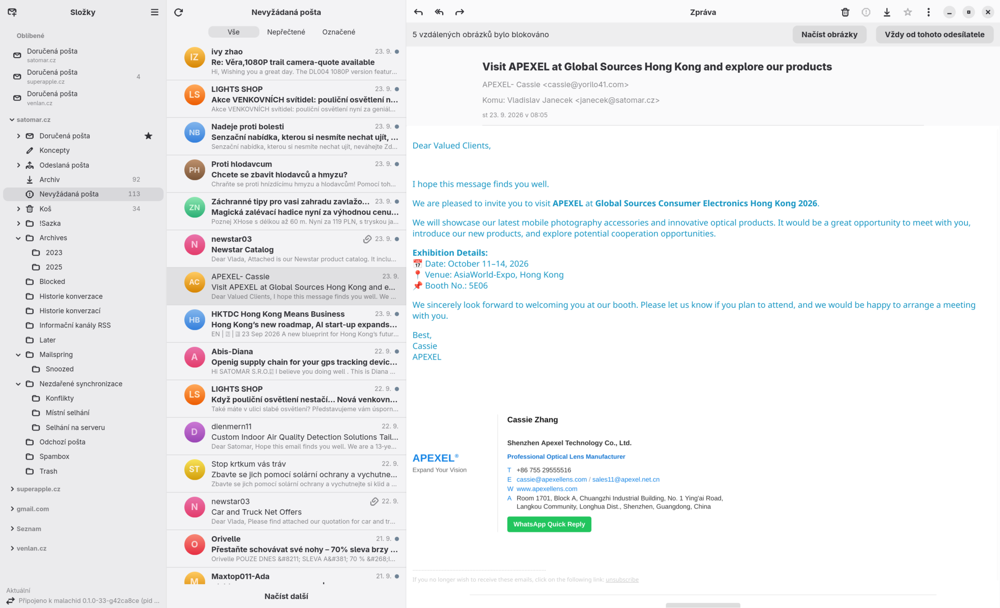
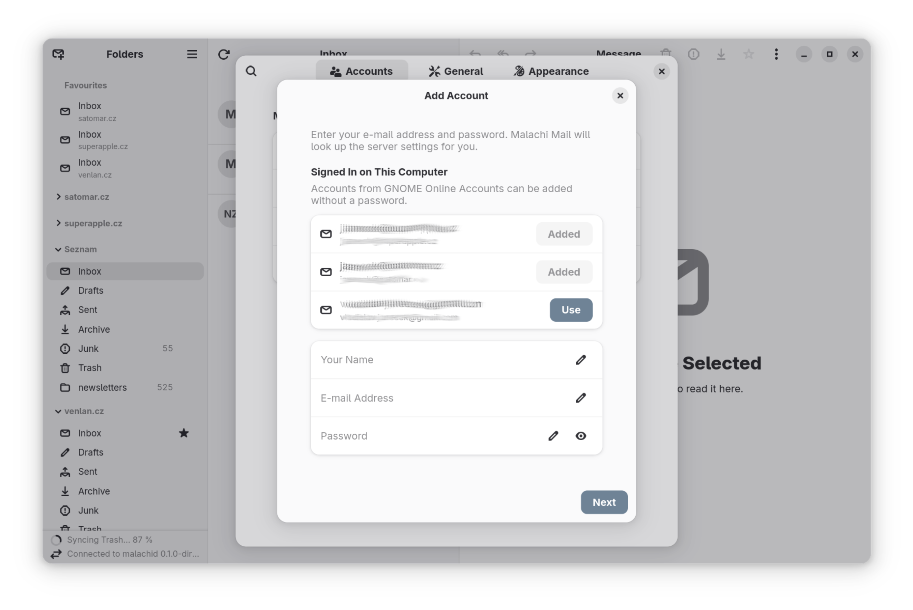
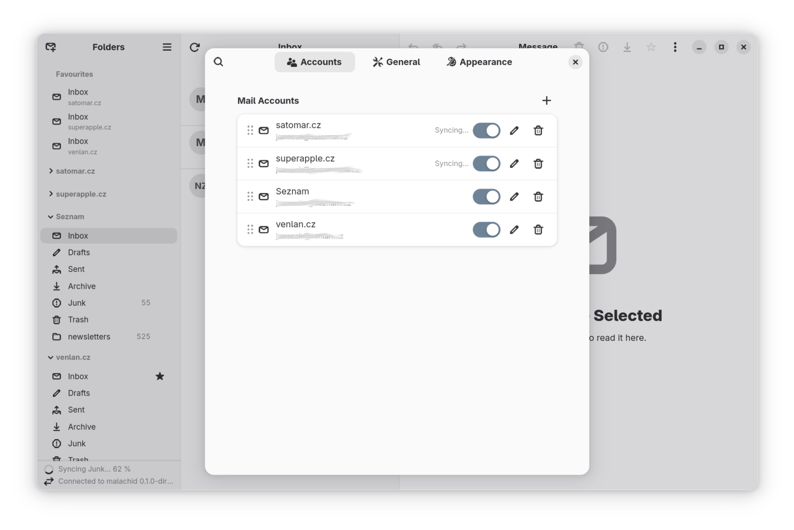
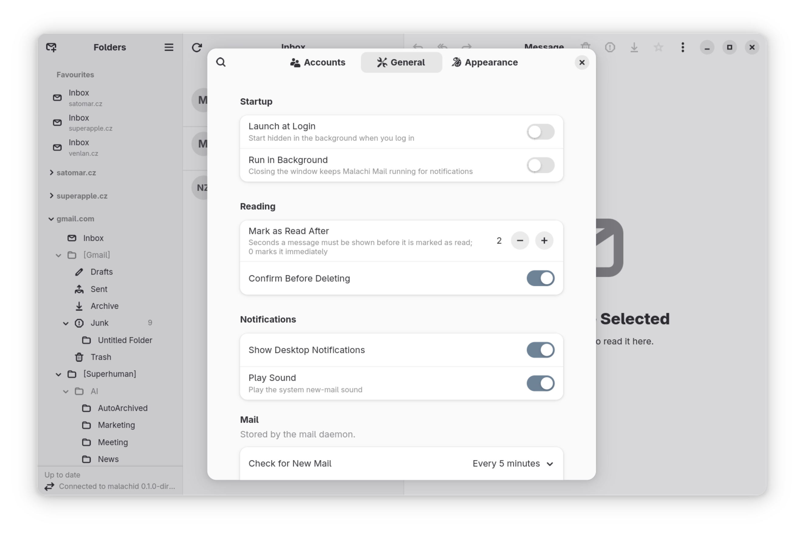
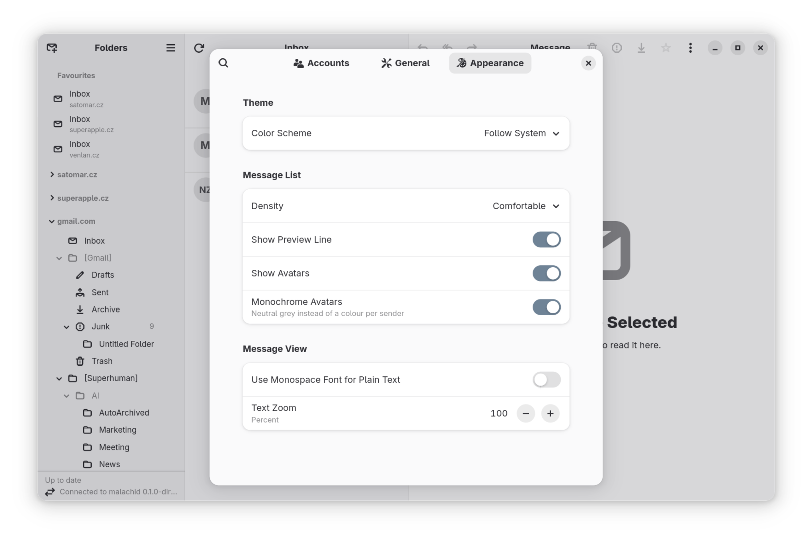

<p align="center">
  
</p>

<h1 align="center">Malachi Mail</h1>

<p align="center">A native email client: one Go core with all the logic, a native UI for each platform. Linux and macOS today, Windows to follow.</p>

Built because the existing options are either showing their age or do not
work reliably anymore, and on Linux that is worse than anywhere else.

> **Project status: early, usable with care.** Version 0.1.0 reads, writes
> and sends mail over IMAP/SMTP and Microsoft 365, renders HTML after
> sanitising it, and keeps mail available offline; Gmail support landed
> on `main` since, and so have conversation threading and an [MCP
> bridge](#ai-agents-mcp) for AI agents. Search is not there yet.
>
> It is young, and a bug in the sync engine can still touch messages on the
> server. Keep a second mail program for anything that matters.

## Screenshots

|  |  |
|---|---|
| [](docs/screenshots/Malachi01.png) | **The main window.** Folders of every account in one sidebar, favourites pinned on top, the message list with its All / Unread / Flagged filter, and the message itself. The bar above the body says the remote images were blocked and offers to load them once or to trust the sender from now on. |
| [](docs/screenshots/Malachi02.png) | **Adding an account.** Accounts already signed in through GNOME Online Accounts are offered without a password; for anything else the assistant looks the server settings up from the address alone. |
| [](docs/screenshots/Malachi03.png) | **Accounts.** Every account can be reordered, paused, edited or removed, and shows what the synchronisation is doing right now. |
| [](docs/screenshots/Malachi04.png) | **General preferences.** Launch at login and running in the background, when a message counts as read, desktop notifications with the system new-mail sound, and how often the mail is fetched. |
| [](docs/screenshots/Malachi05.png) | **Appearance.** Light, dark or the system's choice; the density of the message list, its preview line and avatars; the font and zoom of the message view. |

## What works today

- **Accounts.** IMAP/SMTP with a setup assistant that finds the server
  settings for most providers. Microsoft 365 / Outlook.com and Gmail /
  Google Workspace through GNOME Online Accounts; without them (macOS,
  other desktops) Microsoft 365 and Outlook.com sign in in your browser
  out of the box, and Gmail uses an app password or a Google client of
  your own ([OAuth clients](#oauth-clients-for-gmail-and-microsoft-365)).
  Passwords and tokens live in the system keyring.
- **Reading offline.** Folders and messages are synchronised into a local
  store within a configurable retention window; new mail arrives as the
  server announces it (IMAP IDLE). Flags, moves and deletions are queued
  locally and pushed back.
- **HTML mail, safely.** Bodies are sanitised in the daemon before the UI
  sees them. Remote images stay blocked until you load them or trust the
  sender; the renderer runs with JavaScript off, a strict content policy
  and no network. Attached messages open read-only in their own window.
- **Writing.** Formatted text, attachments and inline images. A message
  that cannot go out right away waits in a local Outbox and is retried; a
  copy is filed in Sent. Recipients are completed from the system address
  books (Evolution Data Server) and from people you have written to.
- **Desktop integration.** `mailto:` links, new-mail notifications with an
  optional sound, launch at login (through the Background portal), light
  and dark styles, a message list with unread/flagged filters, a foldable
  sidebar with favourite folders.
- **Conversations.** The daemon threads mail by its headers as it
  arrives; *Group by Conversation* in the preferences turns the message
  list into one row per conversation, expandable to its messages.
- **AI agents, on a leash.** An optional MCP bridge lets an agent read and
  draft mail through the daemon. Read-only unless you say otherwise;
  marking, moving, deleting and sending each need a separate flag.
- **Czech translation**, and the machinery to add more.

Not yet: search. The RPC contract already defines it; the daemon answers
`notImplemented`.

## Goals

- **One core, native UIs.** All mail logic, every security decision and
  the offline store live in `malachid`, a Go daemon with a documented
  JSON-RPC API and no GUI dependency of its own. Every user interface is a
  thin client of it, so the security model is written once, not per UI,
  and bringing the client to another platform means writing a UI, not a
  mail client. Portability comes from that boundary, not from conditional
  compilation.
- **A native UI on every platform, no web technology for the chrome.**
  GTK 4 / libadwaita on Linux is the primary UI and the template the
  others mirror feature for feature; the Swift/AppKit UI for macOS mirrors
  it today (see [docs/macos-port.md](docs/macos-port.md)) and a WinUI 3 UI
  for Windows is planned.
- **Linux first.** GNOME desktop conventions, portals for everything that
  leaves the sandbox, Flatpak and native packages.
- **Lean.** A native toolkit and one small daemon: a mail client should
  not need a browser engine per window or half a gigabyte of memory to
  show an inbox.
- **Safe HTML mail.** Messages are sanitised in the backend before the UI
  ever sees them; remote content is blocked until you allow it; the
  renderer runs with JavaScript off and a strict content policy.
- **Offline first.** Mail lives in a local SQLite store; full-text search
  will run over it. The network is an optimisation.

## Non-goals

- A webmail or a hosted service.
- Mobile versions.
- Running a mail server, filtering spam server-side, calendaring.

## Architecture

Malachi Mail is two processes. `malachid` is a Go daemon that owns the mail
store, speaks IMAP and SMTP (and Microsoft Graph for Microsoft 365),
synchronises, sanitises HTML, manages credentials and threads
conversations; search will live there too. `malachi` is the GTK 4
application for Linux: it connects to the daemon over a local unix socket
and displays what it is given. The macOS application does the same over
the same socket and the same contract, and the Windows one will.

```
┌──────────────────┐
│  malachi (GTK4)  │ ◄─┐
│  displays, asks  │   │                   ┌────────────────────┐
└──────────────────┘   │   JSON-RPC 2.0    │  malachid (Go)     │
                       ├── unix socket ──► │  all the logic     │
┌──────────────────┐   │                   └─────────┬──────────┘
│  malachi-mcp     │ ◄─┘                             │
│  AI agent bridge │                           ┌─────┴───────┐
└──────────────────┘                           │ SQLite/FTS5 │
                                               └─────────────┘
```

The boundary between them is deliberately hard: it is a socket, not a
package import. Anything the UI needs has to be added to the documented API,
which keeps business logic and security decisions in one place. The MCP
bridge is the proof that it holds: a second client, written against the same
contract, that needed no change in the daemon.

Details: [docs/architecture.md](docs/architecture.md), the RPC contract in
[docs/api.md](docs/api.md), the MCP bridge in [docs/mcp.md](docs/mcp.md),
the threat model in
[docs/security.md](docs/security.md), and how versions and releases work in
[docs/releasing.md](docs/releasing.md).

## Installing

There is no Flathub listing yet. CI builds a Flatpak bundle for **x86_64**
and **aarch64** on every push to `main`; pick one up from the run's
artifacts under [Actions](https://github.com/schotek/malachi/actions)
(kept 30 days) and install it:

```sh
flatpak install --user ./malachi-<version>-x86_64.flatpak
```

Tagged versions will have their bundles attached to the GitHub release.
The bundle pulls the GNOME 48 runtime from Flathub.

Ubuntu does not ship Flatpak any more, so it takes one step first:

```sh
sudo apt install flatpak
flatpak remote-add --if-not-exists flathub https://flathub.org/repo/flathub.flatpakrepo
```

### Native packages

CI also builds a `.deb` and an `.rpm` for both architectures, from the same
artifacts page. They link the system GTK 4, libadwaita and WebKitGTK
instead of carrying a runtime, so they need **libadwaita 1.7 or newer**:
Ubuntu 26.04 LTS, Debian 14 and Fedora 42, but *not* Ubuntu 24.04 LTS,
whose libadwaita is 1.5 and which cannot run the message-list filter. On
24.04 take the Flatpak.

```sh
sudo apt install ./malachi_<version>_amd64.deb      # Debian, Ubuntu
sudo dnf install ./malachi-<version>-1.x86_64.rpm   # Fedora
```

There is no apt or dnf repository, so a package installed this way is not
updated by `apt upgrade` or `dnf upgrade`; the Flatpak is the build that
updates itself.

Unlike the Flatpak, these put `malachi-mcp` on `PATH`, which is what an
[MCP client](#ai-agents-mcp) needs to spawn it.

## Building from source

### Dependencies

Go 1.25, a C compiler (gotk4 uses cgo), GTK 4, libadwaita, Blueprint,
WebKitGTK **6.0** (the GTK 4 flavour; it renders messages and powers the
rich-text compose editor; Blueprint also needs its typelib at build time)
and gsound for the new-mail sound (optional: without it `make` builds with
`-tags nosound` and prints a warning).

Fedora:

```sh
sudo dnf install golang gcc pkgconf-pkg-config git \
    gtk4-devel libadwaita-devel webkitgtk6.0-devel gsound-devel \
    gobject-introspection-devel sqlite-devel blueprint-compiler
```

Debian / Ubuntu. The UI uses `AdwToggleGroup`, so libadwaita must be at
least 1.7: Ubuntu 26.04 LTS or Debian 14 "forky". Ubuntu 24.04 LTS has
libadwaita 1.5 and the UI does not link against it; build the Flatpak
there instead.

```sh
sudo apt install golang-go gcc pkg-config git \
    libgtk-4-dev libadwaita-1-dev libwebkitgtk-6.0-dev gir1.2-webkit-6.0 libgsound-dev \
    libgirepository1.0-dev libsqlite3-dev blueprint-compiler
```

### Build and run

```sh
git clone https://github.com/schotek/malachi.git
cd malachi
make build          # backend → build/malachid, UI → build/malachi
make run-dev        # starts the daemon, waits for its socket, starts the UI
make run-backend    # only the daemon, in the foreground (Ctrl+C stops it)
make run-frontend   # the UI; it starts build/malachid itself unless one is already running
```

The UI runs the daemon: it looks for `malachid` beside its own executable
(then on `PATH`), starts it when nothing answers on the socket and stops it
when the application quits. A daemon started by other means (`make
run-backend`, a debugger) is used and left alone. `MALACHI_DAEMON=none`
turns the automatic start off, and `MALACHI_DAEMON=/path/to/malachid`
picks a different binary.

The first build compiles the gotk4 and WebKitGTK bindings, which takes a
long time (tens of minutes on a laptop) and a few gigabytes of build cache.
It is not stuck. Subsequent builds are fast.

Other targets: `make test`, `make lint`, `make clean`, `make help`, and
`make deb` / `make rpm` to build a native package for the machine you are
on (they need `dpkg-dev` and `rpm-build` respectively).

Set `MALACHI_LOG_LEVEL=debug` to see every RPC call. Passwords go to the
system keyring over D-Bus; in a container without a Secret Service set
`MALACHI_KEYRING=none` to get a clean `keyringError` instead of a timeout
(accounts without a stored password still work). `MALACHI_KEYRING=helper`
hands secrets to an external program instead, named by an absolute path in
`MALACHI_KEYRING_HELPER`: one process per operation, git-credential style,
the request as a JSON line on stdin, the value on stdout (the protocol is
documented in `backend/internal/auth/helper`). The macOS app uses it for
its bundled `malachi-keychain`.

UI preferences are stored in GSettings. `make build` compiles the schema
into `build/glib-2.0/schemas`, and `make run-dev` / `make run-frontend`
export `GSETTINGS_SCHEMA_DIR` so the uninstalled binary finds it. Running
`build/malachi` directly without that variable still works, but preferences
then live in memory and are lost on exit (a warning is logged).

"Launch at Login" asks the Background portal for autostart. Inside a
Toolbx container the portal cannot identify the application ("no AppId
detected") and refuses; test that setting on the host from the installed
desktop file or in the Flatpak.

### macOS

The macOS client lives in [macos/](macos/): a native Swift/AppKit
application over the same daemon and the same contract, mirroring the GTK
UI screen for screen. It reads, writes and sends mail, renders HTML in a
locked-down WebKit view, keeps passwords in the login keychain through a
bundled helper, and carries the Czech translation generated from `po/`.
Microsoft 365 and Outlook.com are added natively through the browser
sign-in with the client Malachi Mail ships; Gmail through an app password,
or the browser sign-in with a Google client of your own
([OAuth clients](#oauth-clients-for-gmail-and-microsoft-365)). Needs
macOS 14, Xcode with a Swift 6 toolchain and Go for the daemon:

```sh
make macos          # build/Malachi Mail.app with malachid, malachi-mcp and malachi-keychain inside
make run-macos      # run it from the terminal so the daemon log stays visible
make test-macos     # swift test, with the generated string catalogues
```

The bundle is ad-hoc signed, which is enough for the machine it was built
on; a rebuild makes the Keychain ask once whether the helper may read the
stored passwords (`make macos SIGN='…'` with a self-signed identity avoids
that). Paths, the keyring, localisation, the deliberate differences from
the GTK UI and what is still missing: [macos/README.md](macos/README.md);
how the client is put together and kept in step with the GTK UI:
[docs/macos-port.md](docs/macos-port.md).

### Flatpak

Build on the host, not inside a container (needs `flatpak-builder` and the
Flathub remote):

```sh
make flatpak        # vendors Go dependencies, builds into build/flatpak and ./repo
make flatpak-run    # runs the freshly built app from the build directory
```

The manifest is [packaging/flatpak/](packaging/flatpak/); the sandbox has
no network, so `scripts/flatpak-vendor.sh` vendors both Go modules first.
Only the keyring, notifications, GNOME Online Accounts, the Settings panel
and the address-book D-Bus names are granted; files, links and autostart go
through portals.

### Translating

The UI is translated with gettext (domain `malachi`); the daemon itself is
language-neutral and only returns codes. Blueprint files mark strings with
`_("…")`, Go code uses `i18n.T` / `i18n.N`. `make build` compiles `po/*.po`
into `build/locale`, which `make run-dev` / `make run-frontend` point the
uninstalled binary at (`MALACHI_LOCALE_DIR`); `scripts/build.sh install`
puts the `.mo` files under `share/locale`.

```sh
make po                      # refresh po/malachi.pot and merge it into every po/*.po
LANGUAGE=cs make run-dev     # try a translation
```

To add a language, append its code to `po/LINGUAS`, run
`msginit -l <code> -i po/malachi.pot -o po/<code>.po`, translate, and open a
pull request. `make lint` checks that every `.po` compiles and that the
committed template matches the sources.

### Where things go

| What | Path |
|---|---|
| Configuration | `~/.config/malachi/config.toml` |
| Mail store | `~/.local/share/malachi/store.db` |
| RPC socket | `$XDG_RUNTIME_DIR/malachi/rpc.sock`, or `~/.cache/malachi/run/rpc.sock` when the variable is unset (containers, ssh); inside Flatpak `$XDG_RUNTIME_DIR/app/io.github.schotek.Malachi/malachi/rpc.sock`. `MALACHI_SOCKET` moves it for `make run-dev` and the UI; the daemon takes `--socket` |
| RPC key | beside the socket, its path plus `.key` (`rpc.sock.key`): the daemon's connection key for the current run, `0600`, replaced at every start and removed on a clean exit (after a crash it stays until the next start replaces it); every client reads it when it connects |
| MCP bridge | `build/malachi-mcp`, spawned by the agent's client over stdio; connects to the socket above |
| macOS | config and store in `~/Library/Application Support/Malachi Mail/`, the socket as above, attachments being opened in `~/Library/Caches/Malachi Mail/open/`, passwords in the login keychain (see [macos/README.md](macos/README.md)) |
| Secrets | system keyring (libsecret), never on disk in the clear |

The store is not encrypted at rest. Use full-disk encryption.

Accounts are managed from *Preferences → Accounts* and stored in the mail
store. For testing, `config.toml` can seed an account; it is imported once,
at the next daemon start, and never written back:

```toml
[[accounts]]
name = "Work"
email = "me@example.org"

[accounts.imap]
host = "imap.example.org"
port = 993
security = "tls"
username = "me@example.org"
auth_method = "password"

[accounts.smtp]
host = "smtp.example.org"
port = 587
security = "starttls"
username = "me@example.org"
auth_method = "password"
```

Passwords never go into this file; they are asked for and kept in the
keyring.

A server with its own certificate, such as Proton Mail Bridge reached
over the network, is refused by default. The account assistant shows why
and offers *Trust Certificate…*: after an explicit confirmation it pins
that certificate's SHA-256 fingerprint to the endpoint, and nothing else
is accepted there. In `config.toml` the same pin is
`certificate_sha256 = "…"` (64 hex digits) in `[accounts.imap]` or
`[accounts.smtp]`; it is refused with `security = "none"` and with
`auth_method = "oauth2"`.

### OAuth clients for Gmail and Microsoft 365

On GNOME, Gmail and Microsoft 365 sign in through GNOME Online Accounts
and need nothing here. Elsewhere — macOS, KDE, any desktop without GNOME
Online Accounts, or an address not signed in there — the daemon signs in
itself: the assistant opens your browser, you sign in with the provider,
and the refresh token goes to the keyring. That needs an OAuth client
registration:

- **Microsoft 365 / Outlook.com** works out of the box: Malachi Mail ships
  its own registration. It is not publisher-verified (that needs a
  verified organisation), so personal Microsoft accounts sign in directly,
  while an organisation that restricts user consent asks its
  administrator to approve *Malachi Mail* once for everybody.
- **Gmail / Google Workspace** has no shipped client: Google's mail scope
  needs an app verification with a yearly paid security assessment
  (CASA). Use an app password (the assistant offers it), or register your
  own client below.

A client of your own, for either provider, goes into `config.toml` —
`~/.config/malachi/config.toml` on Linux (`$XDG_CONFIG_HOME`),
`~/Library/Application Support/Malachi Mail/config.toml` on macOS — and
takes precedence over the shipped one:

```toml
[oauth2.google]
client_id = "1234567890-abc.apps.googleusercontent.com"
client_secret = "GOCSPX-…"

[oauth2.microsoft]
client_id = "00000000-0000-0000-0000-000000000000"
tenant = "common"          # optional; your tenant id or domain for a single-organisation app
```

Restart the daemon afterwards (quit the application, or `make run-dev`
again). Without a Google client id the assistant says so and offers an app
password instead. Keep the file private (`chmod 600`): Google's
desktop-app secret is not confidential by Google's own definition, but the
daemon warns when a file holding one is readable by others.

**Google** (Google Cloud console):

1. Create a project; under *Google Auth Platform* (the OAuth consent
   screen) choose the *External* audience and leave the app in *Testing*,
   with your own Google account added as a test user. An app in testing
   needs no verification; its refresh tokens expire after seven days, and
   the daemon then asks you to sign in again.
2. Under *Clients*, create an OAuth client of type **Desktop app** and copy
   its client ID and client secret. No redirect URI is needed: desktop
   clients accept the daemon's `http://127.0.0.1:<port>/`.

**Microsoft** (Microsoft Entra admin center, *App registrations*):

1. *New registration*, supported account types **Accounts in any
   organizational directory and personal Microsoft accounts** (so
   Outlook.com works too).
2. *Authentication* → *Add a platform* → **Mobile and desktop
   applications**, custom redirect URI `http://127.0.0.1/` (the daemon
   sends `http://127.0.0.1:<port>/` with a port chosen per sign-in; Entra
   ignores the port of a loopback redirect). If the portal accepts only
   `http://localhost`, add `http://127.0.0.1/` and `http://127.0.0.1` in
   the app's *Manifest* (the Microsoft Graph format) under
   `publicClient.redirectUris`.
3. *API permissions* → *Microsoft Graph* → *Delegated*: `Mail.ReadWrite`,
   `Mail.Send`, `User.Read`, `offline_access`.
4. Copy the *Application (client) ID*; there is no secret.

An account can also name its own client (`clientId`, and `tenantId` for
Microsoft) instead of the configured one. A seeded account in
`config.toml` uses this sign-in with `[accounts.oauth2]` `source =
"daemon"` and `provider = "google"` (both endpoints `auth_method =
"oauth2"`); it asks for the browser sign-in once the daemon runs.

## AI agents (MCP)

`make build` also produces `build/malachi-mcp`, a **Model Context Protocol**
server over stdio that gives an AI agent — Claude Code, Zed, Cursor, or any
other MCP client — a gated view of the mail. It is a second client of the
daemon, exactly like the desktop UI: the same socket, the same documented
contract, no mail logic and no credentials of its own. Nothing in the daemon
changed to make it possible.

The repository's `.mcp.json` registers it for Claude Code, so an agent opened
in this checkout can work with the mail as soon as `make run-dev` is up. For
another client, point it at the binary:

```jsonc
{ "command": "/path/to/build/malachi-mcp" }   // add "args": ["-allow-modify"] to permit more
```

What an agent may do is decided when the server starts, not by the model. A
tool outside the granted tier is never registered, so it does not appear in
the agent's tool list at all:

| Tier | How to grant | Tools |
|---|---|---|
| Read and draft | always on | `list_accounts`, `list_folders`, `list_messages`, `read_message`, `get_attachment`, `sync_status`, `trigger_sync`, `create_draft` |
| Modify | `-allow-modify`, or `MALACHI_MCP_ALLOW_MODIFY=true` for `.mcp.json` | `mark_messages`, `move_messages`, `delete_messages` |
| Send | `-allow-send`, or `MALACHI_MCP_ALLOW_SEND=true` | `send_message` |

Drafting needs no flag because a draft is inert: it stays in the local store,
is never synchronised to the server, and goes out only when you send it
yourself or when `send_message` is explicitly allowed. The bridge refuses to
run as root and authenticates every connection with the daemon's per-run
key, only after the daemon has proved that it holds the key; the protocol
version is checked in the same handshake.

Tools, arguments, limits and the threat model: [docs/mcp.md](docs/mcp.md).

## Supported providers

| Provider | Status |
|---|---|
| Generic IMAP/SMTP with password | ✅ reading and sending |
| Microsoft 365 / Outlook.com via GNOME Online Accounts (Microsoft Graph) | ✅ reading and sending; sign in under Settings → Online Accounts first |
| Gmail / Google Workspace via GNOME Online Accounts (IMAP/SMTP with XOAUTH2) | ✅ reading and sending (on `main`, not in 0.1.0); sign in under Settings → Online Accounts first. All Mail is the archive target and is not downloaded |
| Microsoft 365 / Outlook.com without GNOME Online Accounts (Microsoft Graph, the daemon's own sign-in) | ✅ reading and sending (on `main`, not in 0.1.0); you sign in in the browser with the shipped client. Organisations that restrict consent approve the app once, see [OAuth clients](#oauth-clients-for-gmail-and-microsoft-365) |
| Gmail / Google Workspace without GNOME Online Accounts (IMAP/SMTP with XOAUTH2, the daemon's own sign-in) | ✅ reading and sending (on `main`, not in 0.1.0); you sign in in the browser. Needs an OAuth client id and secret in `config.toml` |
| Gmail with an app password | ✅ as the fallback when no sign-in is available (accounts with 2-Step Verification; on `main`, not in 0.1.0) |
| Other OAuth2 providers | ✗ not implemented |

## Contributing

Read [CLAUDE.md](CLAUDE.md) (it applies to humans too: it is the list of
rules we do not bend) and [docs/security.md](docs/security.md) before
touching anything that parses or renders mail. Conventional commits, `gofmt`,
`golangci-lint`.

## Licence

The core (`backend/`, the `malachid` daemon and its API) is
[AGPL-3.0-only](backend/LICENSE) and is also available under a commercial
licence for use in proprietary clients. The reference GTK user interface and
everything else is [GPL-3.0-or-later](LICENSE). See
[LICENSING.md](LICENSING.md) for the details and
[CLA.md](CLA.md) before contributing.

---

*Malachi* is the prophet Malachi (Hebrew *malʼākî*, "my messenger").
