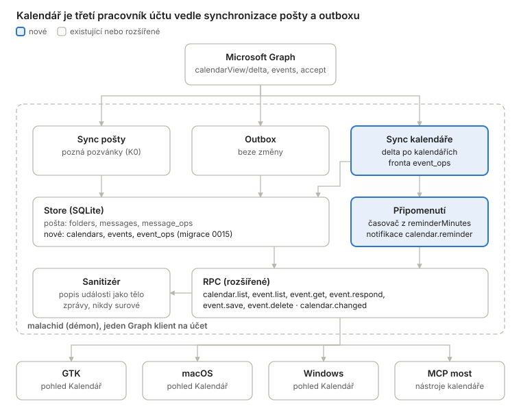
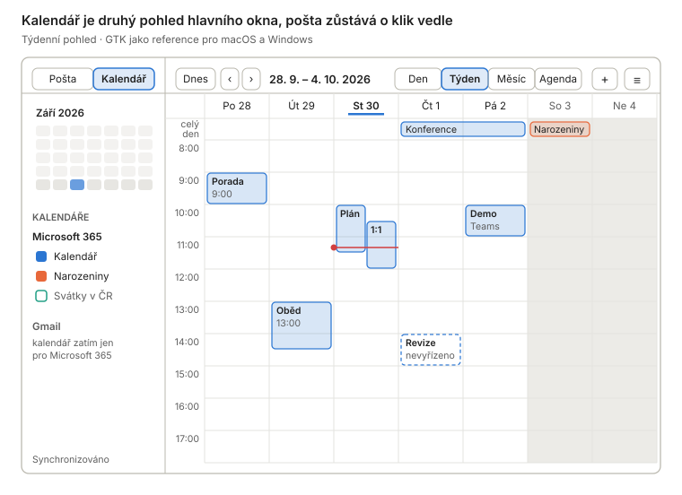
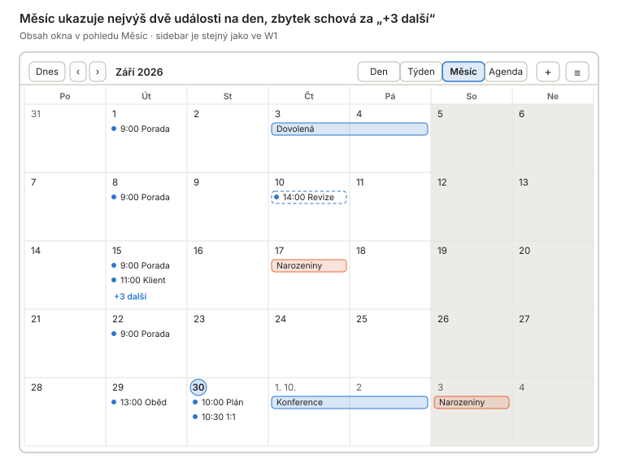
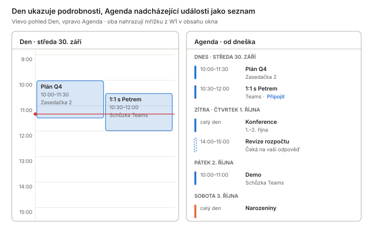
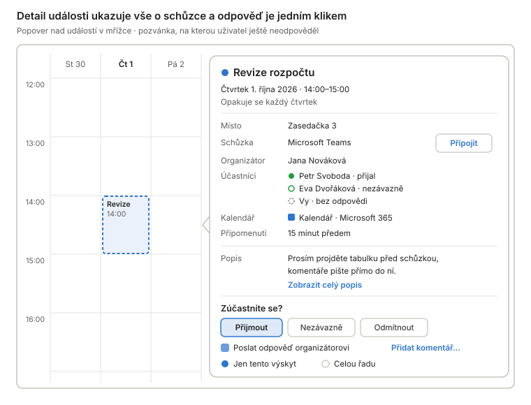
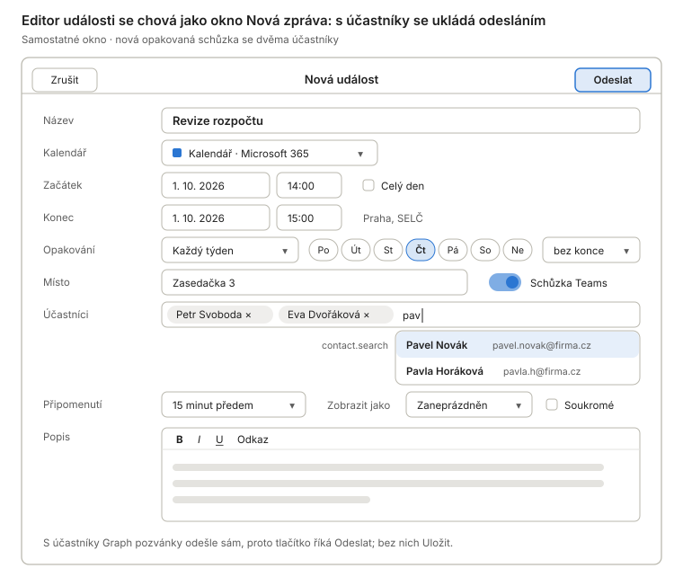
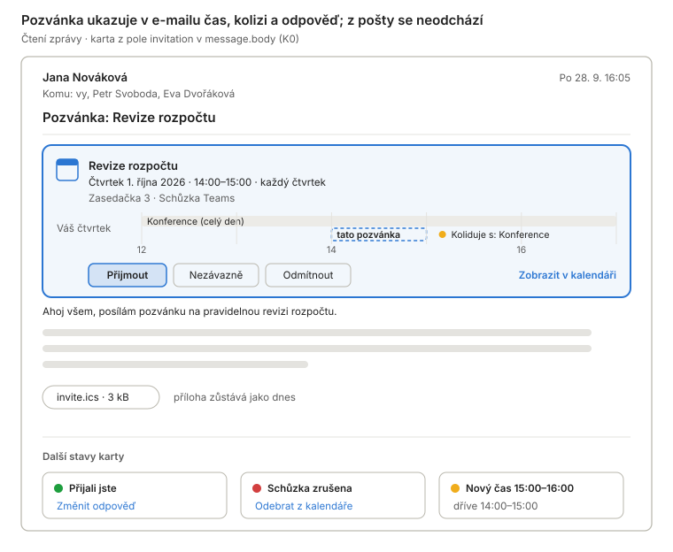
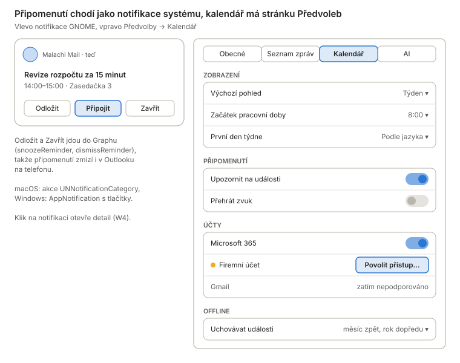
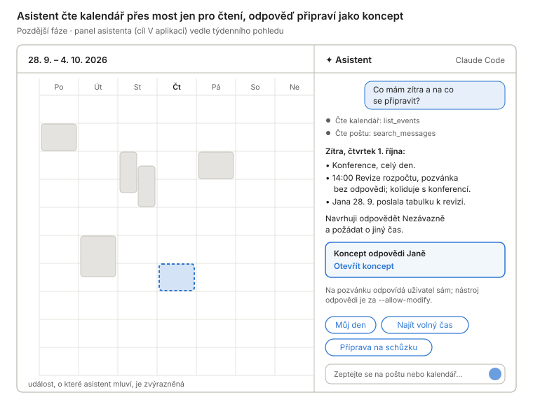
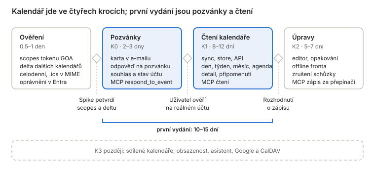

# Kalendář v Malachi Mail – studie proveditelnosti

Stav k 30. 9. 2026 · studie, nic z toho zatím není implementované. Wireframy a schémata jsou v [`calendar-feasibility/`](calendar-feasibility/).

## Závěr

Kalendář pro účty Microsoft 365 je proveditelný bez změny architektury. Démon už Graph používá, server sám rozvíjí opakované události a na GNOME má token potřebné oprávnění už dnes. První vydání (pozvánky v poště a čtení kalendáře ve všech třech klientech) vychází na 10–15 pracovních dní v tempu repozitáře, úpravy událostí na dalších 5–7.

- **Doporučení:** nejdřív půldenní ověření čtyř nejistot, pak pozvánky v poště (K0) jako samostatné vydání a za nimi čtení (K1). O úpravách (K2) rozhodnout podle zkušenosti.
- **Nejdražší je UI.** Žádná platforma nemá týdenní ani měsíční pohled, takže mřížku nakreslíme třikrát nad jednou čistou logikou v Go.
- **Předpoklady:** vlastník zruší bod „calendaring“ mezi cíli, které projekt nedělá (`README.md`), a přidá `Calendars.ReadWrite` do registrace v Entra. Uživatelé vlastního přihlášení pak jednou udělí souhlas.
- **Bezpečnost se nemění:** popis události sanitizuje démon, vše ostatní je prostý text a odkazy schůzek jdou přes potvrzení.

## Rozsah

Kalendář dělím do čtyř úrovní, které jdou nasadit postupně. Každá je použitelná sama o sobě, stejně jako u asistenta úrovně A, B1 a B2. První verze se týká jen účtů `kind: graph` (Microsoft 365, Outlook.com).

| Úroveň | Co uživatel dostane | Co musí umět démon |
| --- | --- | --- |
| **K0 Pozvánky v poště** | Karta nad tělem pozvánky: čas, místo, organizátor, kolize s jinou událostí. Tlačítka Přijmout, Nezávazně, Odmítnout. | Poznat zprávu-pozvánku, dohledat její událost, odeslat odpověď. |
| **K1 Čtení kalendáře** | Pohled Kalendář vedle Pošty: seznam kalendářů účtu, Den, Týden, Měsíc a Agenda. Detail události, připomenutí notifikací, offline okno, čtení přes MCP. | Synchronizace událostí do storu, dotazy na rozsah dat, sanitizace popisu, plánovač připomenutí. |
| **K2 Úpravy** | Nová událost a úprava: čas, místo, účastníci s doplňováním, opakování, připomenutí, schůzka Teams. Smazání a zrušení schůzky. Funguje i offline. | Zápis přes operační log jako u příznaků, řešení konfliktů, sestavení opakování. |
| **K3 Pokročilé** | Sdílené kalendáře kolegů, obsazenost účastníků a plánovač schůzky, návrh jiného času, asistent nad kalendářem, další poskytovatelé (Google, CalDAV). | Další oprávnění a zdroje, mimo první verzi. |

Mimo rozsah této studie jsou úkoly (Microsoft To Do), úprava kontaktů a kalendáře účtů IMAP.

## Microsoft Graph

Graph pokrývá vše, co K0 až K2 potřebují, a jeho nejtěžší část, rozvinutí opakovaných událostí, dělá server. Démon tak pro první verzi nepotřebuje vlastní engine pro RRULE ani parser iCalendar. Náš klient (`internal/graph/client.go`) umí obecné `Get/Post/Patch/Delete`, stránkování, delta odkazy i 429 s `Retry-After`, takže stačí malá úprava: hlavičky na volání a společný semafor na účet.

| Potřeba | Graph v1.0 | Poznámka pro nás |
| --- | --- | --- |
| Seznam kalendářů | `GET /me/calendars` | Jméno, barva `hexColor`, `canEdit`, `isDefaultCalendar`, vlastník. Sdílené kalendáře jsou tam také. |
| Synchronizace | `GET /me/calendarView/delta?startDateTime&endDateTime` | Vrací rozvinuté výskyty. Okno je pevné pro celý řetěz delta odkazů, `$select` a `$filter` nejdou. Smazané přicházejí jako `@removed`. |
| Další kalendáře | `/me/calendars/{id}/calendarView/delta` | Ve v1.0 nezdokumentované (jen beta), Go SDK trasu generuje. Ověřit; jinak nedeltový `calendarView` s `$top` do 1000. |
| Opakování | `recurrence` na `seriesMaster`, výskyty `occurrence` / `exception` | K2 potřebuje jen překlad vzoru (denně, týdně, měsíčně…) do formuláře, ne jeho rozvíjení. |
| Časová pásma | `Prefer: outlook.timezone="…"`, jinak UTC | Klient dnes posílá pevnou hlavičku `Prefer`; potřebuje hlavičku na volání. Celodenní události chodí jako plovoucí datum s exkluzivním koncem (podle Microsoft Q&A, ověřit). |
| Odpověď na pozvánku | `POST /me/events/{id}/accept`, `tentativelyAccept`, `decline` | `comment`, `sendResponse`, u nezávazně a odmítnutí i `proposedNewTime`. |
| Zápis | `POST /me/events`, `PATCH`, `DELETE`, `cancel` | S účastníky Graph pozvánky odešle sám a nejde to vypnout. `transactionId` dělá POST idempotentní. |
| Připomenutí | `reminderMinutesBeforeStart`, `snoozeReminder`, `dismissReminder` | Odložení a zavření se promítne do Outlooku na ostatních zařízeních. |
| Pozvánky v poště | `eventMessage` s `meetingMessageType` a navigací `event` | Outlook sám založí nezávaznou událost; odpovídá se přes ni. |
| Obsazenost účastníků | `POST /me/calendar/getSchedule` | Jen pracovní účty, pro osobní nepodporované. Patří do K3. |

Notifikace o změnách (webhooky) potřebují veřejný HTTPS endpoint, takže démon zůstává u pollingu jako u pošty. Pošta a kalendář sdílejí limit 10 000 požadavků za 10 minut a 4 souběžné na aplikaci a schránku. Dnes má vlastní klient se 4 sloty syncer i outbox, kalendář by byl třetí; souběh proto patří do jednoho sdíleného semaforu na účet.

## Přihlášení a oprávnění

Na GNOME je kalendář bez nového souhlasu, jinde si ho uživatel jednou povolí. Oprávnění `Calendars.Read` i `Calendars.ReadWrite` jsou delegovaná, nevyžadují souhlas správce a fungují i pro osobní účty Microsoft.

| Cesta k tokenu | Kalendář dnes | Co je potřeba |
| --- | --- | --- |
| GOA `ms_graph` 3.52 a novější (Fedora 42 má GNOME 48) | Token už nese `calendars.readwrite` a `calendars.readwrite.shared`. | Číst vlastnost `CalendarDisabled`; dnes se čte jen `MailDisabled`. |
| GOA `ms_graph` 3.50 | Bez kalendářního oprávnění. | Kalendář nedostupný, stav s vysvětlením. |
| Vlastní přihlášení démona (macOS, Windows, Linux bez GOA) | Jen `Mail.ReadWrite`, `Mail.Send`, `User.Read`, `offline_access`. | Přidat `Calendars.ReadWrite` do registrace v Entra a do `oauth2flow/provider.go`. Stávající účty jednou znovu udělí souhlas, refresh token si nové oprávnění nepřidá. |
| Firemní tenant s omezeným souhlasem | Správce schválil jen poštu. | Správce schválí znovu. Do té doby kalendář stojí se stavem, pošta běží dál. |

Chybějící oprávnění dnes nic nepozná. Grant si neukládá udělené scopes a 403 z Graphu se mapuje na `serverError`. Návrh:

- Kalendář je přepínač na účtu. Zapnutí u vlastního přihlášení spustí přihlášení s přidaným scopem (inkrementální souhlas). Kdo kalendář nechce, nový souhlas nikdy neuvidí.
- Grant si zapíše pole `scope` z odpovědi token endpointu. Bez kalendářního scopu dostane kalendář stav `consentRequired` a banner „Povolit přístup ke kalendáři…“.
- Banner využije existující znovupřihlášení (`ensureReauthSession`, `notify.authRequired` s `authUrl`), takže UI nedostane nic nového kromě textu.
- 403 `ErrorAccessDenied` z kalendáře se mapuje na nový kód, ne na `serverError`, a poštu nezastaví.

## Backend

Kalendář dostane vlastního pracovníka na účet, vlastní tabulky a vlastní frontu operací. S poštou sdílí jen token, Graph klienta a sanitizér. Hranice backend ↔ UI zůstává: vše od rozvržení okna synchronizace po připomenutí počítá démon.

Pošta a outbox se nemění; kalendář má vlastní stav, takže jeho chyba (třeba chybějící souhlas) nezastaví poštu.

- **Pracovník.** Třetí supervisor `b.Calendar` s dispatcherem jako `kindOutbox` (`graph` → skutečný, `imap` → prázdný), volaný na stejných místech jako `Supervisor` a `Delivery` (přidání, odebrání, vypnutí a úprava účtu, `StartSync`, znovupřihlášení, `Reload`). Kostra podle `graph.Syncer`: stav, backoff, `Trigger`. Fáze uvnitř `graph.Syncer.cycle` by svázala chyby kalendáře se stavem synchronizace pošty, proto ne.
- **Jeden Graph klient na účet.** Dnes má syncer i outbox vlastní klient se 4 sloty. Limit Microsoftu jsou 4 souběžné požadavky na schránku, takže se semafor přesune na účet a klient dostane hlavičky na volání.
- **Store (migrace 0015).** `calendars` (vzdálené id, jméno, barva, `canEdit`, zapnuto, delta odkaz, okno), `events` (rozvinuté výskyty s `seriesMasterId`, začátek a konec v UTC, celodenní jako datum, odpověď, `showAs`, odkaz schůzky, připomenutí, `changeKey`, popis jako surové HTML), `event_attendees` a `event_ops`. `message_ops` má `CHECK` jen na flag, move a delete, proto vlastní tabulka.
- **Okno synchronizace.** Delta ve `calendarView` má okno pevné pro celý řetěz. Démon proto drží okno širší, než UI ukazuje, a jednou za čas založí nový řetěz s posunutým oknem. Pohled mimo okno (třeba příští rok) dočte démon jednorázově bez delty a neukládá ho. `@removed` mimo okno se filtruje.
- **Opakování.** Ukládají se rozvinuté výskyty tak, jak je vrátí server. Vzor série (`seriesMaster`) se načte až pro úpravu v K2.
- **Časová pásma.** Ukládá se okamžik v UTC a původní zóna. Formátování do místního času dělá UI, jako u data zprávy.
- **Připomenutí.** Démon z `events` spočítá další připomenutí, nastaví časovač a pošle notifikaci `calendar.reminder`. Odložení a zavření jdou přes `event_ops` do Graphu. Démona spouští UI, takže připomenutí chodí, jen když aplikace běží (i na pozadí), stejně jako upozornění na poštu.
- **Pozvánky (K0).** MIME parser už dnes dělá z `text/calendar` přílohu `.ics`. `message.body` se u takové zprávy na účtu Graph jednorázově zeptá na `eventMessage` s rozbalenou událostí a vrátí nové volitelné pole `invitation`. Synchronizace pošty se nemění.
- **Popis události** jde přes `sanitize.Sanitize` v režimu `ModeView` s blokovanými vzdálenými obrázky; MCP dostane `Output.Text`.

## API kontrakt a MCP most

Kontrakt se jen rozšiřuje, takže `ProtocolVersion` zůstává 2. Nové metody, notifikace a chybové kódy jdou do `pkg/api` a `docs/api.md` v jednom commitu; `TestDocsCoverAllMethods` to hlídá.

| Metoda nebo notifikace | Úroveň | Co dělá |
| --- | --- | --- |
| `message.body` → nové pole `invitation` | K0 | Čas, místo, organizátor, stav odpovědi, kolize a `eventId` pozvánky. |
| `event.respond` | K0 | Přijmout, nezávazně, odmítnout; komentář, `sendResponse`, výskyt nebo celá řada. |
| `calendar.list` | K1 | Kalendáře účtů: jméno, barva, `canEdit`, zobrazení, stav synchronizace. |
| `calendar.setVisible` | K1 | Zobrazit nebo skrýt kalendář; lokální volba ve storu. |
| `event.list` | K1 | Výskyty v rozsahu `from`–`to` ze zobrazených kalendářů; mimo okno synchronizace je démon dočte online. |
| `event.get` | K1 | Detail s účastníky a sanitizovaným popisem (`html`, `blocked`, `links` jako `message.body`). |
| `event.snooze`, `event.dismiss` | K1 | Odložení a zavření připomenutí, promítne se do Outlooku. |
| `event.save` | K2 | Nová nebo upravená událost, u opakované s volbou rozsahu; offline přes `event_ops`. |
| `event.delete` | K2 | Smazání, u organizátora zrušení schůzky s komentářem. |
| notifikace `calendar.changed` | K1 | Účet, kalendáře a rozsah, který se změnil; UI si znovu načte `event.list`. |
| notifikace `calendar.reminder` | K1 | Událost k připomenutí; notifikaci s textem vytvoří UI. |

Nové chybové kódy (čísla přidělí tabulka v `docs/api.md` §2): chybějící souhlas ke kalendáři, událost už neexistuje, kalendář jen pro čtení. Stav kalendáře přibude do `account.list`, aby UI mohlo ukázat banner.

MCP most dostane čtení ve výchozím režimu a zápis za přepínači:

- `list_calendars`, `list_events`, `get_event` jsou jen pro čtení. Název, místo a popis události píše cizí člověk (organizátor), takže jdou přes `clean()` a do ohrady s nonce jako pošta. Popis jen jako text.
- `respond_to_event` je za `--allow-modify`, protože mění stav v kalendáři a organizátor dostane e-mail.
- `create_event` a `update_event` s účastníky jsou za `--allow-send`: Graph pozvánky odešle sám a nejde to vypnout, takže je to odeslání pošty. Bez účastníků stačí `--allow-modify`.

## UI ve třech klientech

UI je největší položka. Žádná ze tří platforem nemá hotový denní, týdenní ani měsíční pohled, takže mřížku nakreslíme třikrát. Všechno, co není kreslení, bude jednou v čistém Go a přenese se 1:1 i s testy, stejně jako u asistenta.

| Platforma | Co je hotové | Co se napíše |
| --- | --- | --- |
| GTK 4.18, libadwaita 1.7 | `GtkCalendar` na mini měsíc, `Adw.ToggleGroup` na přepínače, `Gtk.Popover` | Mřížka dne a týdne jako vlastní widget, měsíc, agenda v `GtkListView`. GNOME Calendar má vlastní pohledy v C pod GPL-3.0-or-later; poslouží jako předloha, ne jako kód k převzetí. |
| macOS, AppKit | `NSDatePicker` na mini měsíc, `NSSegmentedControl`, `NSPopover` | Vlastní `NSView` s mřížkou. EventKitUI v AppKitu není, jen v Mac Catalyst. |
| Windows, WinUI 3 | `CalendarView`, `CalendarDatePicker`, `TimePicker`, `Flyout` | Vlastní mřížka nad `Canvas` nebo vlastním layoutem. Community Toolkit plánovač nemá, Syncfusion Scheduler je komerční. |

Do čisté logiky (`ui/internal/calendar`, pak `MalachiCore/Calendar` a `Malachi.Core/Calendar`) patří:

- rozložení kolidujících událostí do sloupců a řádky celodenních pruhů,
- kolik událostí se vejde do buňky měsíce a text „+N další“ přes `i18n.N`,
- navigace, rozsah pohledu, první den týdne podle locale,
- formáty dat a rozsahů jako strftime msgid,
- pravidla dostupnosti: kdy je blok odpovědi, kdy Upravit, kdy Připojit,
- přístupné popisky událostí pro čtečky obrazovky („Revize rozpočtu, čtvrtek 14:00–15:00, čeká na odpověď“).

Hlavní okno GTK dnes nemá žádný `ViewStack`. Kalendář potřebuje nový `Adw.ViewStack` kolem `outer_split` v `window.blp` s přepínačem Pošta / Kalendář. macOS dostane přepínač do toolbaru nad `MainSplitViewController`, Windows do titulkové lišty v `MainWindow.xaml`; odchylky se zapíšou do tabulek v `macos/README.md` a `windows/README.md`. Klávesy Ctrl+1 a Ctrl+2 (na macOS ⌘1 a ⌘2) přepínají pohledy.

Nové klíče gschema: zvolený pohled, zapnutá připomenutí a začátek pracovní doby pro týdenní mřížku. macOS a Windows je přebírají pod stejnými jmény. Nové msgid musí Windows klient použít, jinak test pokrytí selže.

Wireframy níže ukazují každou část.

### Přehled obrazovek

Wireframy kreslí GTK klienta jako referenci; macOS a Windows mají tytéž části v nativních prvcích podle tabulek odchylek. Modrá je kalendář účtu, oranžová Narozeniny, čárkovaný okraj nevyřízená pozvánka.

| Wireframe | GTK | macOS | Windows |
| --- | --- | --- | --- |
| W1–W3 pohledy | `Adw.ViewStack` v hlavním okně, přepínač v sidebaru | Přepínač v unified toolbaru | Přepínač v titulkové liště |
| W4 detail | `Gtk.Popover` | `NSPopover` | `Flyout` |
| W5 editor | Samostatné okno jako Nová zpráva | Samostatné okno | Samostatné okno |
| W6 pozvánka | Karta nad tělem zprávy | Karta se symbolem jako bannery | `InfoBar` nad tělem |
| W7 připomenutí | `GNotification` s akcemi | `UNUserNotificationCenter` s akcemi | `AppNotification` s tlačítky |
| W8 asistent | Panel `assistant_split` | Inspektor asistenta | `AssistantSplit` |

### W1 Hlavní okno: týdenní pohled

Sidebar má nahoře přepínač Pošta / Kalendář, pod ním mini měsíc a kalendáře účtu s barvou a zaškrtnutím; účet bez kalendáře je zašedlý. Nevyřízená pozvánka je čárkovaně, kolidující události stojí vedle sebe a červená čára ukazuje aktuální čas. Klik na událost otevře detail (W4), dvojklik nebo + editor (W5).

### W2 Měsíční pohled

Celodenní a vícedenní události jsou pruhy, události s časem tečka s časem a názvem. Klik na „+3 další“ otevře den ve W3, klik na číslo dne také. Kolik událostí se do buňky vejde, počítá čistá logika z výšky buňky, ne pohled.

### W3 Den a agenda

Den má místo na místo a způsob připojení. Agenda je plochý seznam po dnech od dneška; hodí se i na úzké okno, kam se týden nevejde, a stejný seznam vrací MCP nástroj. „Připojit“ otevře odkaz schůzky přes potvrzení „Otevřít tento odkaz?“ jako odkazy v odpovědích asistenta.

### W4 Detail události

Detail je popover: GTK `Gtk.Popover`, macOS `NSPopover`, Windows `Flyout`. Blok odpovědi se ukazuje jen tam, kde organizátor odpověď chce a uživatel není organizátor. Volba „Jen tento výskyt / Celou řadu“ je jen u opakované události. Popis je sanitizované HTML z démona, stejně jako tělo zprávy; celý popis se otevře v uzamčeném webovém pohledu. Organizátor místo odpovědi vidí Upravit a Zrušit schůzku.

### W5 Editor události

Doplňování účastníků je existující `contact.search`, popis je existující editor z okna Nová zpráva a posílá se jako sanitizované HTML. Opakování nabízí jen vzory, které má Graph (denně, týdně, měsíčně, ročně). Úprava výskytu opakované události se nejdřív zeptá „Jen tento výskyt, nebo celou řadu?“. Účastník (ne organizátor) editor neotevře, má jen detail z W4.

### W6 Pozvánka ve zprávě

Karta jde nad tělo v obou místech čtení: v panelu hlavního okna i v samostatném okně zprávy. Kolize se počítá z uložených událostí, a když kalendář není zapnutý, démon se jednorázově zeptá na `calendarView` toho dne. Stavy dole plynou z `meetingMessageType` a z `previousStartDateTime` u změny času. Zrušení má místo odpovědi „Odebrat z kalendáře“.

### W7 Připomenutí a Předvolby

„Firemní účet“ ukazuje stav bez kalendářního souhlasu: tlačítko spustí znovupřihlášení s přidaným scopem. Stejný stav má banner v pohledu Kalendář. Okno offline je návrh výchozí hodnoty; rozhoduje o velikosti storu a o tom, jak často se zakládá nový delta řetěz.

### W8 Asistent nad kalendářem (K3)

Panel je existující B1; přibudou jen nástroje mostu z předchozí kapitoly a rychlé akce. Celý obsah kalendáře je pro model cizí text v ohradě s nonce, stejně jako pošta. „Najít volný čas“ potřebuje `getSchedule`, takže funguje jen na pracovních účtech.

## Bezpečnost

Kalendář nepřináší nový druh útoku, jen nová místa, kudy teče cizí text. Pravidla 2 a 3 z `CLAUDE.md` na ně platí beze změny. Pozvánku může poslat kdokoli a Exchange ji sám zapíše do kalendáře jako nezávaznou, takže událost je stejně nepřátelský vstup jako e-mail.

- **Popis události** je HTML od organizátora. Jde přes `sanitize.Sanitize` s blokovanými vzdálenými obrázky a zobrazí se jen v uzamčeném webovém pohledu. `event.get` surové HTML nikdy nevrátí.
- **Název, místo a jména účastníků** jsou prostý text: `SetUseMarkup(false)`, `stringValue`, `TextBlock.Text`, i v popoveru a v mřížce. Notifikace připomenutí nese název události, takže pro ni platí totéž co pro upozornění na novou poštu.
- **Odkaz schůzky a odkazy v popisu** se otevírají jen po potvrzení s vypsanou adresou a jen `https`. Připomenutí nic samo neotevírá. Podvržený odkaz „Teams“ je běžný phishing, proto potvrzení ukazuje doménu.
- **Nevyžádané pozvánky.** Odmítnutí s odpovědí potvrdí odesílateli, že adresa žije. Karta a detail proto nabízejí i „Odmítnout bez odpovědi“ (`sendResponse: false`) a u odesílatele mimo sebrané adresy ho dávají první.
- **iCalendar.** K0 až K2 pro Graph nic neparsují, Graph vrací JSON; `.ics` z pošty zůstává přílohou. Parser RFC 5545 přijde až s IMAP nebo CalDAV v K3 a bude to nový parser nepřátelského vstupu s patologickými testy v `backend/testdata/mime` (obrá `RRULE`, zanořené komponenty, přeložené řádky, neplatné UTF-8) a limitem rozvinutí opakování.
- **JSON z Graphu** je také vstup: limity počtu účastníků, délky textů a velikosti popisu (sanitizér má strop 2 MiB).
- **MCP** vše z kalendáře čistit přes `clean()` a vrátit v ohradě s nonce. Nástroje, které mění stav nebo posílají poštu, jsou za přepínači.

Do `docs/security.md` přibude oddíl o kalendáři a do kontrolního seznamu v §12 body o popisu události a odkazu schůzky.

## Etapy a náročnost

První vydání (pozvánky a čtení) je 10–15 pracovních dní v tempu tohoto repozitáře, úpravy dalších 5–7. Měřítkem jsou dosavadní funkce podle historie gitu: vyhledávání (backend, GTK, MCP, macOS) byl jeden den, vlákna dva dny, klient pro Windows dva dny a doladění. Kalendář je větší než každá z nich, protože má nový synchronizační zdroj i nové kreslené pohledy.

Každý krok končí bránou, za kterou se pokračuje až po ověření; pošta mezitím běží beze změny.

| Část (dny) | K0 | K1 | K2 |
| --- | --- | --- | --- |
| Backend: sync, store, API, `docs/api.md` | 1 | 3–4 | 2 |
| Čistá logika v Go a testy | 0,25 | 1–2 | 1 |
| GTK | 0,25 | 2–3 | 1–1,5 |
| Port macOS | 0,5 | 1–1,5 | 0,5–1 |
| Port Windows | 0,5 | 1–1,5 | 0,5–1 |
| MCP most a dokumentace | 0,25 | 0,5 | 0,5 |
| **Celkem** | **2–3** | **8–12** | **5–7** |

Odhad nezahrnuje vizuální ladění mřížek, které dělá uživatel na skutečném stroji, ani sestavení Swiftu a C# na Macu a na Windows.

## Rizika a otevřené otázky

Největší technické riziko je třikrát kreslená mřížka, největší organizační je souhlas s novým oprávněním u účtů mimo GOA.

| Riziko | Dopad | Co s tím |
| --- | --- | --- |
| Vlastní mřížka ve třech toolkitech | Nejdražší část, vizuální ladění a přístupnost třikrát | Maximum v čisté logice s testy 1:1, pohledy jen kreslí. V GTK skládat standardní widgety, kde to jde; gotk4 má u vlastního kreslení známé úniky paměti. |
| Nový souhlas u vlastního přihlášení | Stávající uživatelé macOS a Windows se musí jednou přihlásit znovu; firmy žádají správce | Kalendář jako přepínač na účtu, souhlas až při zapnutí, pošta běží dál. |
| Delta dalších kalendářů není ve v1.0 zdokumentovaná | Mohla by kdykoli zmizet | Ověřit ve spiku; náhradou je nedeltový `calendarView` pro okno. |
| Celodenní události a časová pásma | Posun o den na hranicích pásem | Celodenní jako plovoucí datum, testy nad záznamy skutečných odpovědí Graphu. |
| Limit 4 souběžných požadavků sdílený s poštou | 429 a zpomalení pošty při první synchronizaci kalendáře | Jeden semafor na účet, kalendář s nižší prioritou a delším intervalem než inbox. |
| Připomenutí jen při běžící aplikaci | Zavřená aplikace = žádné připomenutí | Stejné jako u pošty; Windows má běh na pozadí v oznamovací oblasti, macOS login item. Na GTK otevřená otázka. |
| Linux má i cestu přes EDS | Kontakty se kvůli ní řešily přes EDS | U kalendáře ne: EDS je jen Linux a macOS s Windows potřebují Graph v démonu tak jako tak. EDS může přijít později jako další zdroj. |

Rozhodnutí vlastníka před startem:

- [ ] Zrušit bod „calendaring“ mezi cíli, které projekt nedělá (`README.md`), a zapsat rozhodnutí do `docs/architecture.md` §7.
- [ ] Přidat `Calendars.ReadWrite` do registrace aplikace v Entra (klient `af56e4e6-…`).
- [ ] Rozsah prvního vydání: jen K0, nebo K0 s K1.
- [ ] Výchozí okno offline (návrh: měsíc zpět, rok dopředu).
- [ ] Kalendář jako pohled hlavního okna (návrh), nebo samostatné okno.
- [ ] Připomenutí se zavřenou aplikací na GTK: běh na pozadí, nebo ne.

## Zdroje

Dokumentace (otevřená 30. 9. 2026):

- [event resource](https://learn.microsoft.com/en-us/graph/api/resources/event?view=graph-rest-1.0), [calendar resource](https://learn.microsoft.com/en-us/graph/api/resources/calendar?view=graph-rest-1.0), [eventMessage](https://learn.microsoft.com/en-us/graph/api/resources/eventmessage?view=graph-rest-1.0)
- [event: delta v1.0](https://learn.microsoft.com/en-us/graph/api/event-delta?view=graph-rest-1.0), [event: delta beta](https://learn.microsoft.com/en-us/graph/api/event-delta?view=graph-rest-beta), [Delta query pro události](https://learn.microsoft.com/en-us/graph/delta-query-events), [List calendarView](https://learn.microsoft.com/en-us/graph/api/calendar-list-calendarview?view=graph-rest-1.0)
- [Get event a Prefer outlook.timezone](https://learn.microsoft.com/en-us/graph/api/event-get?view=graph-rest-1.0), [celodenní události (Microsoft Q&A)](https://learn.microsoft.com/en-us/answers/questions/1373145/all-day-events-fetched-from-microsoft-graph-api-ar)
- [Create event](https://learn.microsoft.com/en-us/graph/api/user-post-events?view=graph-rest-1.0), [accept](https://learn.microsoft.com/en-us/graph/api/event-accept?view=graph-rest-1.0), [snoozeReminder](https://learn.microsoft.com/en-us/graph/api/event-snoozereminder?view=graph-rest-1.0), [getSchedule](https://learn.microsoft.com/en-us/graph/api/calendar-getschedule?view=graph-rest-1.0)
- [Permissions reference](https://learn.microsoft.com/en-us/graph/permissions-reference), [Throttling limits](https://learn.microsoft.com/en-us/graph/throttling-limits), [Webhooky](https://learn.microsoft.com/en-us/graph/change-notifications-delivery-webhooks)
- [GOA goamsgraphprovider.c](https://gitlab.gnome.org/GNOME/gnome-online-accounts/-/raw/master/src/goabackend/goamsgraphprovider.c), [GtkCalendar](https://docs.gtk.org/gtk4/class.Calendar.html), [pohledy GNOME Calendar](https://gitlab.gnome.org/GNOME/gnome-calendar/-/tree/main/src/gui/views), [EventKitUI](https://developer.apple.com/documentation/eventkitui), [WinUI: datum a čas](https://learn.microsoft.com/en-us/windows/apps/design/controls/date-and-time)

Repozitář (HEAD `cc6bb26`):

- `backend/internal/graph/client.go`, `sync.go`, `supervisor.go`, `ops.go`
- `backend/internal/auth/oauth2flow/provider.go`, `backend/internal/auth/goa/goa.go`
- `backend/internal/core/dispatch.go`, `backend.go`, `accounts.go`, `draft_sync.go`
- `backend/internal/store/ops.go`, `migrations/0005_mail.sql`, `0014_raw_storage.sql`
- `backend/internal/mime/mime.go`, `backend/internal/sanitize/sanitize.go`, `backend/cmd/malachi-mcp/`
- `ui/data/ui/window.blp`, `macos/Sources/MalachiMail/MainWindow/MainSplitViewController.swift`, `windows/src/Malachi.App/MainWindow.xaml`
- `README.md` (kalendář mezi cíli, které projekt nedělá), `docs/architecture.md` §7
