# Kontakty na serveru v Malachi Mail – studie proveditelnosti

Stav k 30. 9. 2026 · studie, nic z toho zatím není implementované. Wireframy jsou v [`contacts-feasibility/`](contacts-feasibility/).

## Závěr

Správa kontaktů uložených na serveru poštovního účtu (zobrazení, hledání, vytvoření, úprava, smazání a obousměrná synchronizace) je proveditelná ve všech třech klientech. Mění ale rozhodnutí z 6. 9. 2026 (`docs/architecture.md` §7), které vlastního klienta CardDAV i Graph zamítlo. Kontakty bude synchronizovat démon sám přes CardDAV a Microsoft Graph, všechna tři UI i MCP budou pracovat jen nad jeho API a EDS zůstane jen pro čtení.

- **Pokrytí v 1. etapě:** Microsoft 365 a Outlook.com, Seznam.cz, iCloud, Fastmail, Nextcloud, GMX, mailbox.org, Posteo a Zoho. Google přijde ve 3. etapě.
- **Rozsah:** tři etapy. Čtení a úpravy (etapy 1 a 2) vycházejí na ≈ 17–24 tisíc řádků včetně testů, zhruba 2–3 týdny.
- **Předpoklady:** vlastník nahradí zamítnutí z 6. 9. a přidá delegované oprávnění `Contacts.ReadWrite` do registrace aplikace v Entra. Technické překážky nejsou.
- **Hlavní riziko** je ztráta údajů jiných aplikací při úpravě kontaktu. Démon proto mění jen upravené vlastnosti a zápis přijde až ve 2. etapě.
- **Bezpečnost:** vCard je nepřátelský vstup jako e-mail. Žádné HTML, fotky z URL se nestahují a na server jde jen výslovné smazání.

## Výchozí stav

Malachi Mail dnes kontakty nespravuje, jen je používá k doplňování příjemců (`contact.search`, `docs/api.md` §4.11).

| Zdroj | Odkud | Linux (GTK) | macOS | Windows |
| --- | --- | --- | --- | --- |
| **Nedávno použité** (`collected_addresses`) | Adresy, kterým uživatel psal (outbox po doručení, jednorázově ze složek Odeslané). Nikdy z příchozího `From`. | ano | ano | ano |
| **Adresáře GNOME** (EDS) | D-Bus `Sources5` + `AddressBook10`, `GetContactList`, jen čtení, jen knihy účtu odesílatele. | ano, s EDS | ne | ne |
| **Kontakty na serveru** | — | nepřímo přes EDS | ne | ne |

Rozhodnutí z 6. 9. 2026 výslovně zamítlo „Microsoft Graph přímo“ i „vlastního klienta CardDAV“. Zdůvodnění: na GNOME by duplikovaly EDS, bez GOA by k Microsoftu nebyl token a Microsoft 365 CardDAV nemá.

## Co se od 6. září změnilo

Tři ze čtyř předpokladů tehdejšího rozhodnutí už neplatí. Proto studie navrhuje rozhodnutí otevřít znovu, ne ho obejít.

| Tehdejší důvod | Dnes |
| --- | --- |
| Na GNOME by vlastní synchronizace duplikovala EDS. | Platí jen pro GTK. Od té doby vznikli **dva klienti bez EDS** (macOS 14+, Windows 11), kde doplňování běží jen nad nedávno použitými adresami. Duplicitu na GNOME vyřeší pravidlo „knihy EDS účtu, jehož kontakty synchronizuje démon, se přeskočí“ (W6). Navíc Microsoft 365 v EDS obstarává balíček evolution-ews, který běžná instalace GNOME mít nemusí. |
| Bez GNOME Online Accounts není token pro Graph. | **Neplatí.** Démon má vlastní přihlášení (`oauth2flow`, PKCE, vestavěná registrace Microsoftu), na macOS a Windows je to jediná cesta. |
| Microsoft 365 nemá CardDAV. | Platí dál. Proto dva protokoly: CardDAV pro obecné servery, Graph pro Microsoft. Pro Graph už démon má klienta, delta dotazy a immutable ID. |
| Čtení mezipaměti EDS z disku je křehké. | Platí dál a návrh ho nepotřebuje. |

Přibyl i důvod navíc: MCP most (`docs/mcp.md`) plánuje politiku příjemců pro `send_message` nad „adresami z adresáře“. Na macOS a Windows žádný adresář není.

## Rozsah

Kontakty, které žijí na serveru poštovního účtu, se obousměrně synchronizují do lokálního úložiště démona. Uživatel je vidí, hledá a upravuje v Malachi a změny se projeví i v ostatních klientech (telefon, webmail, Kontakty v macOS).

- **V rozsahu:** adresáře účtu a výběr, které synchronizovat; seznam, hledání a detail kontaktu; vytvoření, úprava a smazání; práce offline s frontou změn a slučováním konfliktů; „Přidat do kontaktů“ z hlavičky zprávy; serverové kontakty v doplňování příjemců na všech platformách; nástroje MCP pro čtení (a zápis za přepínačem).
- **Později (3. etapa):** Google Contacts, fotky kontaktů, skupiny a štítky, import a export vCard, přesun mezi adresáři různých účtů.
- **Mimo rozsah:** zápis do systémových adresářů (EDS, `CNContactStore`, Windows), adresář organizace (GAL) a hledání v něm, lokální adresář bez serveru, sdílení adresářů a jejich oprávnění, kalendáře (CalDAV).

## Poskytovatelé a protokoly

Dva protokoly pokryjí prakticky všechny účty, které Malachi umí přidat: **CardDAV** (RFC 6352, obecné servery včetně Seznamu) a **Microsoft Graph** (Microsoft 365 a Outlook.com, kde CardDAV není). Google má vlastní odchylky od CardDAV a patří do 3. etapy.

| Účet v Malachi | Protokol | Přihlášení | Kontakty | Etapa | Na co pozor |
| --- | --- | --- | --- | --- | --- |
| **Microsoft 365 / Outlook.com**, vlastní přihlášení démona | Graph | OAuth, vestavěný klient | ano | 1 | Registrace v Entra potřebuje `Contacts.ReadWrite`. Delta jen po složkách. U osobních účtů nejde zapsat fotku; seznamy kontaktů (distribuční) Graph zatím nemá. |
| **Microsoft 365** přes GNOME Online Accounts | Graph | token GOA | ano | 1 | GOA od 3.52 žádá `contacts.readwrite` (Fedora 42 má 3.54). Respektovat vypnuté Kontakty účtu v Nastavení GNOME. |
| **Seznam.cz** (i email.cz, post.cz) | CardDAV | heslo, s 2FA „heslo pro poštovní protokoly“ | ano | 1 | `carddav.seznam.cz`, SRV `_carddavs._tcp.seznam.cz` existuje, `OPTIONS` hlásí `addressbook` (ověřeno 30. 9.). email.cz a post.cz SRV nemají → záznam v tabulce poskytovatelů. Podporu `sync-collection` ověřit s účtem. |
| iCloud | CardDAV | heslo aplikace | ano | 1 | vCard 3.0; skupiny jako samostatné karty. |
| Fastmail | CardDAV | heslo aplikace | ano | 1 | `carddav.fastmail.com`; nabízí i JMAP Contacts (RFC 9610). |
| Nextcloud, Radicale, Baïkal | CardDAV | heslo aplikace | ano | 1 | Často jiný host než pošta → ruční adresa (W7). |
| GMX, WEB.DE, mailbox.org, Posteo, Zoho | CardDAV | heslo, s 2FA heslo aplikace | ano | 1 | GMX, Posteo a Zoho odmítají skupinové karty; Posteo má potíže s fotkami; Zoho neukazuje adresář organizace. |
| **Gmail** přes GNOME Online Accounts | Google CardDAV | token GOA | ano | 3 | Token GOA nese `auth/carddav` i `m8/feeds`. Google zakládá kontakt přes `POST`, ne `PUT`; jen vCard 3.0; štítky se na CardDAV nepromítají. V GTK je do té doby pokrývá EDS. |
| Gmail s vlastním klientem OAuth | Google CardDAV nebo People API | OAuth, klient uživatele | s výhradou | 3 | Kontakty nejsou omezený scope (CASA ne), ale Gmail ano, takže vestavěný klient Google dál nebude. Klient ve stavu „Testing“ má refresh token na 7 dní. |
| Gmail s heslem aplikace | — | heslo | ne | — | Google CardDAV přijímá od června 2023 jen OAuth. |
| Yahoo | CardDAV | heslo aplikace | nespolehlivé | — | DAVx⁵ uvádí, že ho Yahoo už nepodporuje. Nenabízet automaticky. |
| Proton | — | Bridge | ne | — | Bez CardDAV i API. |

### Proč Google až ve 3. etapě

Technicky to jde (token z GOA má scope, CardDAV kód bude hotový), ale užitek je v první fázi malý a práce nemalá:

- V GTK s GOA kontakty Google do doplňování už dodává EDS.
- Na macOS a Windows má Gmail jen heslo aplikace nebo vlastního klienta uživatele. S heslem aplikace kontakty nejdou vůbec, vlastní klient je výjimka.
- Google CardDAV se od RFC odchyluje (vytvoření přes `POST`, jen vCard 3.0, bez štítků) a `go-webdav` `POST` nemá. People API je druhá, úplně jiná implementace (JSON, `etag` v `metadata.sources`, sync token platí 7 dní).

Levná mezivarianta, pokud by Google spěchal: **jen čtení** Google CardDAV s tokenem GOA už v 1. etapě (tentýž kód jako ostatní CardDAV, jen Bearer token místo hesla).

## Varianty architektury

### A · Systémové adresáře — zamítnout

Každý klient by zapisoval do adresáře svého systému: EDS na Linuxu, `CNContactStore` na macOS a `ContactStore` na Windows.

- Logika v UI a platformní kód ve třech podobách (pravidla 1 a 4). MCP by nic neviděl.
- macOS: souhlas TCC, párování účtu a kontejneru jen odhadem. Exchange v Kontaktech macOS navíc stále jede přes EWS, které Microsoft od října 2026 vypíná.
- Windows: nebalená aplikace potřebuje identitu balíčku, plný zápis vyžaduje zvláštní povolení Microsoftu a aplikace Lidé skončila 31. 12. 2024.

### B · Zápis přes EDS jen na Linuxu — zamítnout jako hlavní cestu

Nejrychlejší cesta pro GTK: EDS umí zapisovat do Google (CardDAV) i Microsoft 365 (evolution-ews) a má vlastní řešení konfliktů (`CreateContacts`, `ModifyContacts`, `RemoveContacts`).

- macOS a Windows by funkci neměly, což porušuje paritu (pravidlo 6).
- D-Bus rozhraní EDS je formálně soukromé (`src/private/`, veřejné je jen libebook).
- Microsoft 365 v EDS je v balíčku evolution-ews, který běžná instalace GNOME mít nemusí.

### C · Synchronizace v démonu — doporučeno

Démon sám synchronizuje CardDAV a Graph (později Google) do svého úložiště a nabízí API všem třem UI a MCP. EDS dál slouží jen ke čtení při doplňování pro účty, které démon nesynchronizuje.

- Jedna implementace, přesně podle pravidel 1 a 4 a stejného vzoru jako pošta (supervisor účtu, operační log, delta).
- Knihovny od téhož autora jako `go-imap`, `go-message` a `go-smtp`, které jádro už používá.
- Nejvíc práce a riziko ztráty dat při round-tripu vCard. Obojí řeší etapy a korpus.

### Jak to řeší jiní

- **Thunderbird** má vestavěný CardDAV s autodetekcí od verze 91 (2021) a Google přes CardDAV s OAuth. Microsoft 365 přes Graph přidal ve verzi 154 (září 2026) jen pro poštu, adresář ani kalendář přes EWS či Graph nepodporuje.
- **Evolution** dělá všechno přes EDS (Google, Microsoft 365, EWS, CardDAV) s plnou úpravou.
- **Geary** kontakty neupravuje; čte je přes EDS a úpravu předá aplikaci Kontakty GNOME.
- **Apple Mail** používá systémové Kontakty.
- **Mailspring** upravuje kontakty Google a CardDAV, Microsoft 365 ne; synchronizuje asi po 45 minutách.
- **eM Client** umí CardDAV, Google i Exchange a ve verzi 11 přechází z EWS na Graph.

Z otevřených klientů výše spravuje kontakty Microsoft 365 jen Evolution, a to jen na Linuxu. Malachi by to umělo na všech třech platformách.

## Backend

Všechno níže žije v `backend/` a je platformně neutrální Go: týž kód poslouží GTK, macOS, Windows i MCP mostu. UI dostane hotová data a posílá jen příkazy (pravidlo 1).

### Nové balíčky

| Balíček | Co dělá | Poznámka |
| --- | --- | --- |
| `internal/vcard` | Parser a serializér vCard 3.0 a 4.0 (čte i 2.1 ze starých exportů). Mapování na model kontaktu a zpět. Úprava kontaktu je *patch*: mění jen dotčené vlastnosti a verzi karty, ostatní řádky zůstanou bajt po bajtu. Nová karta se píše ve verzi, kterou server ohlásí (Google a iCloud jen 3.0). | Vlastní tenký parser jako u `internal/mime`, případně nad `emersion/go-vcard` (MIT). Ten je ale mladý (v0.1.0, srpen 2026), stavěný na vCard 4 a převod 4 → 3 nemá. Limity a patologický korpus v `backend/testdata/vcard` (pravidlo 3). |
| `internal/contacts/carddav` | Discovery (RFC 6764), seznam adresářů, `sync-collection` (RFC 6578) se záložní cestou přes ctag + ETag a `addressbook-multiget`, zápis `PUT` s `If-Match` / `If-None-Match: *`, mazání s `If-Match`. | Nad `emersion/go-webdav` (MIT, v0.7.0): discovery, multiget a `SyncCollection` má, ale zápis bez `If-Match` (v kódu je na to TODO) a `POST` pro Google nemá. Podmíněné zápisy jako vlastní tenké požadavky nad stejným HTTP klientem, nebo příspěvek do knihovny. TLS z `internal/transport` včetně pinu certifikátu. |
| `internal/discover` | Nález serveru kontaktů k účtu: SRV `_carddavs._tcp` s TXT `path=`, `/.well-known/carddav`, `current-user-principal`, `addressbook-home-set`. Tabulka poskytovatelů (`ispdb.go`) dostane CardDAV pro domény bez SRV. | email.cz a post.cz → `carddav.seznam.cz`; iCloud, Fastmail, GMX. |
| `internal/graph` (+ `contacts.go`) | `/me/contactFolders`, delta kontaktů po složkách, CRUD na `/me/contacts`, fotka (`/photo/$value`). Úprava je `PATCH` jen změněných polí. | Stávající klient, immutable ID (bez nich se ID kontaktu při přesunu mění) a zpracování 410/resync z pošty se použijí znovu. U osobních účtů je fotka jen pro čtení. |
| `internal/core/contacts_*.go` | Synchronizace per účet (v supervisoru účtu vedle pošty), operační log, slučování konfliktů, metody API, `contact.search` se třemi zdroji, odstranění duplicit s EDS. | Vzor: `draft_sync.go`, `message_ops`. |
| `store` + migrace `0015_contacts.sql` | Tabulky `address_books`, `contacts` (surová karta nebo JSON Graphu, ETag/changeKey, odvozené sloupce pro řazení a hledání), `contact_emails` (index pro doplňování a „je v kontaktech?“), `contact_ops`. | Migrace dopředná, jako vždy. Kontakty účtu mizí s účtem při `deleteLocalData`. Číslo 0015 si nárokuje i studie kalendáře; dostane ho ta, která přijde dřív. |

### Synchronizace

- **Kdy:** při startu účtu, každých 15 minut, po otevření okna Kontakty a hned po lokální změně. Kontakty se mění zřídka, IDLE ani push není potřeba.
- **Stažení:** CardDAV `sync-collection` s uloženým tokenem; když ho server nemá nebo token odmítne, porovná se ctag a seznam ETagů a změněné karty se stáhnou přes `multiget` po 100. Graph přes delta dotaz po složkách s uloženým `deltaLink`. Obojí stránkuje, takže ani adresář s 20 000 kontakty nezahltí paměť.
- **Zápis:** každá úprava z UI nebo MCP je nejdřív řádek v `contact_ops` se základní verzí (ETag nebo changeKey). Worker ho odešle; úspěch uloží novou verzi, `412` nebo změněný changeKey spustí slučování. Dokumentace Graphu u kontaktů `If-Match` neuvádí: jestli služba vrací 412, se ověří pokusem v etapě 0, jinak démon porovná `changeKey` těsně před zápisem. Offline úpravy tak čekají a odejdou po připojení (W10 d).
- **Slučování:** po vlastnostech. Když lokální a serverová změna sahají na různé vlastnosti, sloučí se samy. Když na stejnou, přímá úprava v UI dostane chybu `contactConflict` s oběma verzemi (W9). Úprava z fronty offline uloží serverovou verzi a vlastní uloží jako novou kopii, takže se nic neztratí.
- **Pojistka proti hromadnému mazání:** na server se posílá jen smazání, o které výslovně požádal uživatel nebo MCP s `--allow-modify`. Lokální ztráta dat (smazaná databáze, odebraný účet, změna URL) se nikdy nepropíše jako mazání na serveru.

### API kontrakt

Všechno se jen přidává, takže `ProtocolVersion` zůstane 2. Jediná změna tvaru existující odpovědi je nová hodnota `"source": "contacts"` v `contact.search`. Swift dekóduje výčty striktně, takže nový démon se starým klientem by selhal. Klienti se ale vydávají s démonem v jednom balíku a změna jde do všech tří najednou (pravidlo 6), takže to nevadí; stojí to za řádek v §4.11.

```jsonc
AddressBook { "id", "accountId", "name", "readOnly", "selected", "isDefault",
              "count", "lastSyncAt" (opt) }
ContactSummary { "id", "bookId", "displayName", "sortKey", "email" (opt), "hasPhoto" }
ContactCard { "id", "bookId", "readOnly", "revision",
              "name": { "given", "family", "middle", "prefix", "suffix" },
              "displayName", "nickname", "org", "title",
              "emails":    [{ "label", "address", "preferred" }],
              "phones":    [{ "label", "number" }],
              "addresses": [{ "label", "street", "city", "region", "postcode", "country" }],
              "urls": [ … ], "birthday": { "year" (opt), "month", "day" }, "note",
              "preserved": 3 }          // počet vlastností, které UI nezná a které zůstanou

addressBook.list    { accountId (opt) }                 → { books: [AddressBook] }
addressBook.update  { bookId, selected (opt), isDefault (opt) }
contact.list        { bookId | accountId (opt), query (opt), offset, limit } → { contacts, total }
contact.get         { contactId }                        → ContactCard
contact.lookup      { addresses: [..] }                  → { known: { address: contactId } }
contact.create      { bookId, card }                     → { contactId, revision }
contact.update      { contactId, revision, card }        → { revision }
contact.delete      { contactId, revision }
contact.move        { contactId, bookId }                // 2. etapa
contact.photo       { contactId }                        // 3. etapa, jen data: PNG/JPEG
contact.search      + "source": "contacts", + param "scope": "account" | "all"

notify.contactsChanged { accountId, bookIds }

1106 contactNotFound · 1107 addressBookNotFound · 1108 addressBookReadOnly
1306 contactConflict  (data = { mine, server, fields })
notify.authRequired  + "feature": "contacts"  (chybí scope, pošta běží dál)
```

Nastavení účtu dostane blok `contacts` (`enabled`, u IMAP účtů `carddavUrl`, `certificateSha256` a `sameCredentials`). Heslo CardDAV je v klíčence jen tehdy, když se liší od IMAP. `account.discover` vrací nalezený server kontaktů jako návrh, `account.oauthStart` dostane `features: ["contacts"]` pro inkrementální souhlas.

### OAuth

- `oauth2flow.providerScopes` přestane být pevná tabulka: základní scopes pošty + `Contacts.ReadWrite` (Graph) nebo scope kontaktů Google, jen když má účet kontakty zapnuté. Kdo kontakty nechce, nevidí jiný souhlas než dnes.
- **Vestavěná registrace Microsoftu** v Entra musí dostat delegované oprávnění `Contacts.ReadWrite`. To je úkon vlastníka v portálu Entra, ne kód. U organizací s omezeným souhlasem ho správce schválí znovu (nové oprávnění = nový souhlas).
- Token z GNOME Online Accounts si scopes neurčuje, ale už je nese: Microsoft 365 od GOA 3.52 `contacts.readwrite`, Google `auth/carddav` a `m8/feeds`. Účty z GOA tak kontakty dostanou bez nového souhlasu. Démon respektuje vypnuté Kontakty účtu v Nastavení GNOME (vlastnost `ContactsDisabled` rozhraní účtu GOA; ověřit při implementaci).

### MCP most

- Nástroje jen pro čtení: `search_contacts`, `get_contact`. Výstup jako všechno z pošty: `clean()` a ohrada s nonce, protože poznámka nebo jméno ve sdíleném adresáři je text třetí strany.
- Za `--allow-modify`: `create_contact`, `update_contact`. Mazání kontaktů přes MCP nenavrhuji vůbec.
- Vedlejší přínos: politika příjemců pro `send_message` („jen adresy z kontaktů nebo dříve psané“), kterou `docs/mcp.md` uvádí jako další krok, dostane skutečný adresář, o který se může opřít.

## Bezpečnost

- **vCard je nepřátelský vstup** stejně jako e-mail: sdílený adresář, kontakt založený jinou aplikací nebo škodlivý server může poslat cokoli. Parser má limity (velikost karty 1 MiB včetně fotky, 500 vlastností, 100 adres, délka řádku), toleruje neplatné UTF-8 a staré kódování `QUOTED-PRINTABLE`, a korpus v `testdata/vcard` pokrývá zalomení řádků uprostřed UTF-8, nekonečné skupiny, obří base64, nesmyslné `CHARSET` a vnořené escape sekvence. Fuzz test nad parserem a nad patchem (parse → patch → parse musí zachovat nedotčené vlastnosti).
- **Žádné HTML ani markup.** `NOTE` je prostý text. UI zobrazuje všechno přes `SetUseMarkup(false)`, `stringValue`, `TextBlock.Text` (pravidlo 3).
- **Fotka z URL se nikdy nestahuje.** vCard 4 dovoluje `PHOTO:https://…`, což by fungovalo jako sledovací pixel. Použije se jen vložená fotka; démon ji dekóduje a znovu zakóduje s kontrolou rozměrů před dekódováním (`image.DecodeConfig`, ochrana proti dekompresní bombě) a UI dostane jen `data:`.
- **Odkazy a telefony** (`URL`, `X-SOCIALPROFILE`, `TEL`) jsou text s kopírováním. Otevření webu jde přes stávající dialog „Otevřít tento odkaz?“ a jen pro `http(s)`.
- **Známý kontakt jen podle adresy.** „Zobrazit kontakt“ u čipu a řádek z doplňování se párují jen přesnou shodou adresy, nikdy podle zobrazovaného jména, které útočník volí sám.
- **Nic z příchozí pošty se neuloží samo.** Pravidlo `collected_addresses` platí dál, přidání odesílatele je vždy výslovný krok s kontrolou jména (W5).
- **Logy** obsahují jen počty a ID, nikdy jména, adresy ani obsah karet (stejně jako u hledání).
- **Flatpak:** žádné nové `finish-args`; síť už aplikace má. EDS zůstává jen pro čtení, poznámka v `security.md` §9 platí beze změny.
- `docs/security.md` dostane odstavec o kontaktech: co se ukládá lokálně, proč se nestahují fotky z URL a pojistku proti hromadnému mazání.

## UI ve třech klientech

Podle pravidla 6 jde změna do všech tří klientů v jedné práci: nejdřív čistá logika v Go (`ui/internal/contacts`: model seznamu, řazení a sekce podle písmen, validace formuláře, texty) a GTK jako reference, hned potom port do `MalachiCore`/`MalachiMail` a `Malachi.Core`/`Malachi.App` i s testy. Wireframy kreslí GTK jako referenci a u macOS a Windows jen to, co se liší podle tabulek odchylek v jejich README.

Kontakty jsou **samostatné okno**, ne čtvrtý panel hlavního okna. Hlavní okno už má tři panely, panel asistenta a čtyři body zlomu; další režim by rozbil skládání při 900 a 600 sp na všech platformách. Samostatné okno odpovídá Thunderbirdu (karta Adresář) i macOS (Mail + Kontakty) a jde otevřít odkudkoli.

Čísla v oranžových kolečkách odkazují na poznámky pod obrázkem. Texty jsou česky tak, jak by je ukázal `cs.po`; msgid budou anglické. Jména a adresy jsou smyšlené.

### Přehled obrazovek

| Obrazovka | GTK | macOS | Windows |
| --- | --- | --- | --- |
| Okno Kontakty (W2, W11, W13) | Dvakrát vnořený `Adw.NavigationSplitView` | `NSSplitViewController`, unified toolbar | Hledání v titulkové liště, `CommandBar` |
| Úprava (W3, W12, W14) | Pravý panel v režimu úprav | Úprava na kartě | Pravý panel, popisky nad poli |
| Potvrzení a konflikt (W9, W10) | `Adw.AlertDialog` | `NSAlert` | `ContentDialog` |
| Pruhy stavu (W10) | `Adw.Banner` | Karta se symbolem | `InfoBar` |
| Přidat do kontaktů (W5) | `Gtk.Popover` z čipu | `NSPopover` | `Flyout` |

### W1 Vstupní body

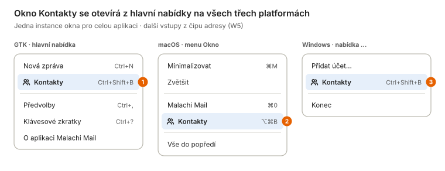

1. Akce `app.contacts`, jedna instance okna pro celou aplikaci (druhé vyvolání ho jen přenese do popředí). Zkratka jako v Thunderbirdu; v GTK UI dnes volná.
2. Návrh zkratky: ⌘⇧B by kolidovala s formátováním v editoru, ⌥⌘B je volná. Položka jde podle tabulky odchylek do menu baru, ne do toolbaru.
3. Na Windows v nabídce „…“ v titulkové liště vedle Přidat účet a Konec (odchylka „menu … s Přidat účet a Konec“ z `windows/README.md`).

### W2 GTK: okno Kontakty

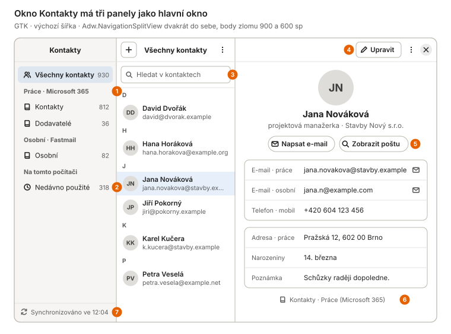

1. Adresáře seskupené podle účtů, v pořadí účtů z Předvoleb. Účet bez zapnutých kontaktů tu není. „Všechny kontakty“ sčítá vybrané adresáře účtů, bez „Nedávno použitých“.
2. **Nedávno použité** jsou dnešní `collected_addresses` ukázané jako virtuální adresář jen pro čtení, s akcí „Uložit do kontaktů…“. macOS a Windows bez serverového adresáře tak mají co ukázat hned v první fázi.
3. Hledá démon nad lokální kopií (`contact.list` s parametrem `query`), už od prvního znaku a bez sítě. Adresáře GNOME (EDS) se tu neukazují, ty dál slouží jen doplňování.
4. Upravit přepne detail do režimu úprav (W3). V nabídce ⋮ jsou položky Přesunout do adresáře…, Exportovat jako vCard… a Smazat… (W10 a).
5. Zobrazit poštu otevře hlavní okno s hledáním `from:jana.novakova@…`. Použije existující `search.query`, v démonu se nic nemění. Napsat e-mail u kontaktu s více adresami nabídne výběr adresy.
6. Odkud kontakt je. Adresář jen pro čtení má místo tlačítka Upravit štítek *Jen pro čtení*.
7. Stav synchronizace kontaktů. Chyba účtu se ukáže pruhem nad seznamem (W10 c), ne tady.

### W3 GTK: úprava kontaktu

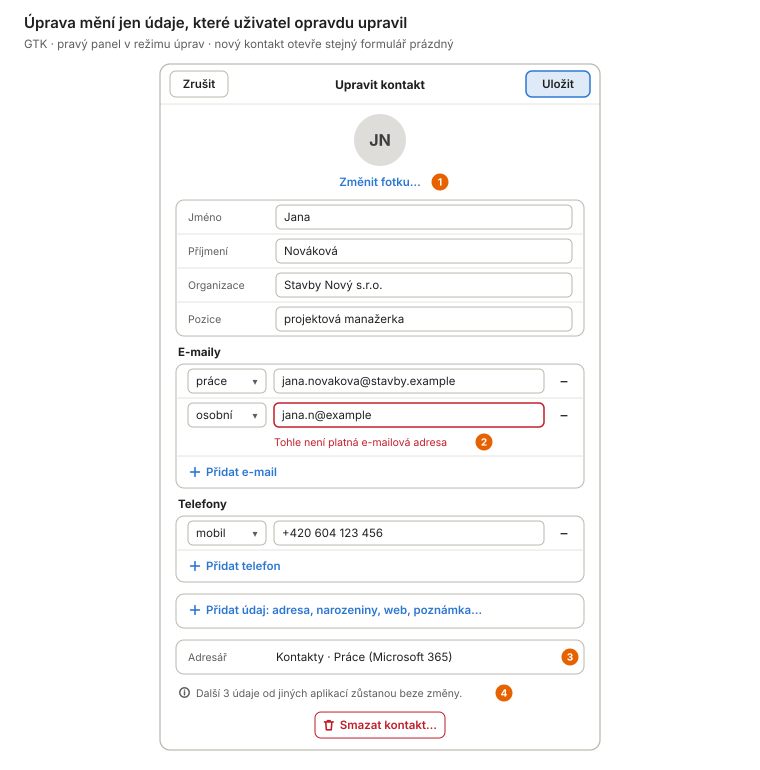

1. Fotka až ve 3. etapě. Obrázek dekóduje a zmenší démon (nejvýš 512 px, PNG nebo JPEG); UI dostane jen `data:` a nic nestahuje z URL uvedené ve vCard.
2. Validace adres je sdílená s oknem Nová zpráva (`compose.ParseAddressList`). Uložit zůstane neaktivní, dokud je v některém poli chyba; démon validuje znovu a vrátí `invalidArgument` s cestou k poli.
3. U existujícího kontaktu jen informace. U nového kontaktu je tu rozbalovací výběr adresáře (výchozí je adresář z předvoleb účtu, W8). Přesun mezi adresáři je samostatná akce, protože mezi servery znamená vytvořit a smazat.
4. Klíčová vlastnost kvůli datům uživatele: démon upraví jen změněné vlastnosti vCard (nebo pole Graphu) a ostatní vrátí serveru beze změny, včetně neznámých `X-…` vlastností, skupin a fotky.

### W4 GTK: úzké okno

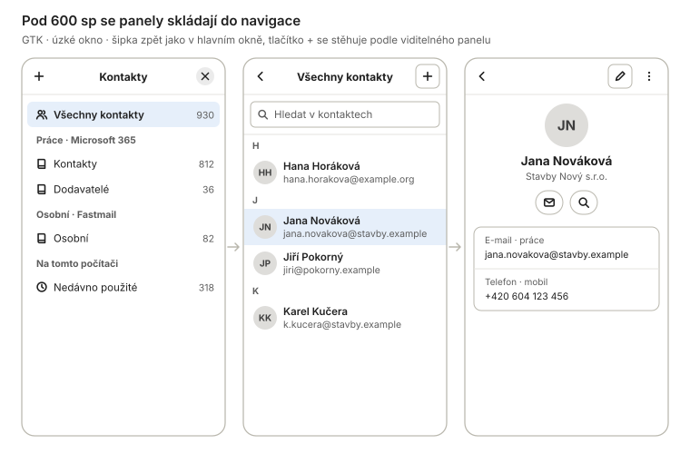

Pod 600 sp se panely skládají do navigace se šipkou zpět jako v hlavním okně; tlačítko + se stěhuje podle toho, který panel je vidět.

### W5 Přidat do kontaktů z hlavičky zprávy

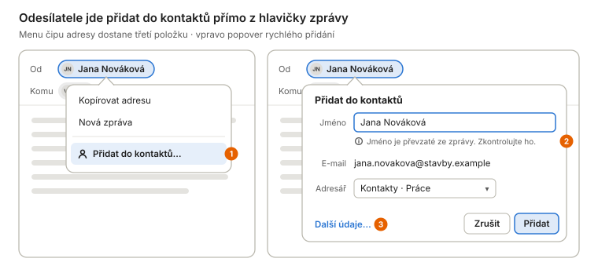

Menu čipu adresy (dnes Kopírovat adresu a Nová zpráva) dostane třetí položku.

1. U adresy, která už v kontaktech je (přesná shoda adresy bez ohledu na velikost písmen), je místo toho položka **Zobrazit kontakt**, která otevře okno Kontakty na něm. Stejné menu dostane řádek výsledku hledání a okno zprávy.
2. Jméno z hlavičky `From` je text útočníka. Předvyplní se, ale je vybrané a upozornění je vidět. Nic se neuloží bez kliknutí na Přidat a pravidlo „nikdy z příchozího `From`“ pro `collected_addresses` se nemění.
3. Další údaje… otevře okno Kontakty s rozpracovaným novým kontaktem (W3). Výchozí adresář je adresář účtu, do kterého zpráva přišla.

### W6 Doplňování příjemců

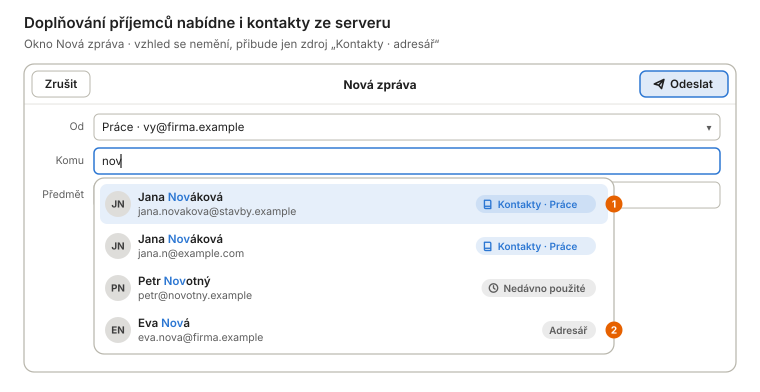

1. `contact.search` dostane třetí zdroj `"source": "contacts"` (serverové kontakty účtu, ze kterého se píše). Stejná adresa z více zdrojů je dál jeden řádek a jméno z kontaktu má přednost. Kontakt se dvěma adresami dává dva řádky.
2. EDS zůstává zdrojem `addressBook` pro účty, jejichž kontakty démon sám nesynchronizuje (typicky Google z GOA v 1. a 2. etapě). U účtu se zapnutými kontakty se knihy EDS téhož účtu přeskočí, jinak by se každý kontakt nabízel dvakrát.

### W7 Průvodce účtem

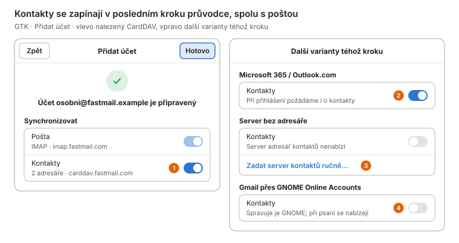

Kontakty se zapínají spolu s poštou, ne v samostatném průvodci.

1. `account.discover` zkusí CardDAV podle RFC 6764 (SRV `_carddavs._tcp`, `/.well-known/carddav`) a tabulky poskytovatelů (email.cz a post.cz SRV nemají) se stejnými přihlašovacími údaji jako IMAP. Nález se jen nabídne; bez odpovědi do 5 s se krok ukáže bez kontaktů a průvodce nečeká.
2. Vlastní přihlášení démona přidá scope `Contacts.ReadWrite` jen když je přepínač zapnutý (inkrementální souhlas). Vypnuto = dnešní scopes beze změny.
3. Ruční adresa CardDAV (např. Nextcloud na jiném hostu než pošta). Stejná pravidla jako IMAP: TLS povinné, pin certifikátu přes „Důvěřovat certifikátu…“.
4. Token z GOA scope pro kontakty Google nese (`auth/carddav`), ale Google se od CardDAV odchyluje; zapnutí je 3. etapa (viz [Proč Google až ve 3. etapě](#proč-google-až-ve-3-etapě)). Do té doby je v GTK nabízí EDS.

### W8 Účet a Předvolby

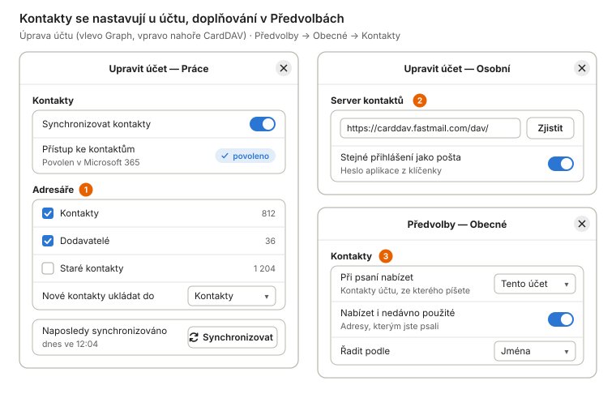

1. Adresáře z `addressBook.list`; výběr se ukládá v konfiguraci účtu v démonu (ne v GSettings), aby platil stejně pro všechna UI i MCP. Nevybraný adresář se nesynchronizuje vůbec, ne jen skryje.
2. Jen u účtů IMAP. Změna adresy zahodí lokální kopii kontaktů a stáhne je znovu, stejně jako změna hosta zahodí pin certifikátu.
3. Dva nové klíče GSettings (`contacts-suggest-scope`, `contacts-sort`) a jejich zrcadla v `UserDefaults` a v registru; `contact.search` dostane volitelný parametr `scope`. Na macOS a Windows bez skupiny Předvoleb se vyhledáváním (tabulky odchylek).

### W9 Konflikt úprav

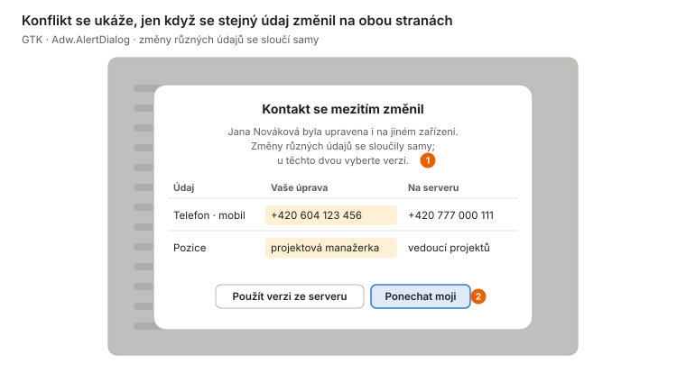

1. Démon při odmítnutém zápisu (CardDAV `412 Precondition Failed` na `If-Match`; u Graphu změněný `changeKey`) stáhne serverovou verzi a sloučí po vlastnostech. Dialog přijde jako chyba `contactConflict` s daty obou verzí.
2. Offline úprava, která se pak srazí, nečeká na dialog: uloží se serverová verze a vaše se zachová jako kopie „Jana Nováková (konflikt)“. Kontakt se tak nikdy tiše neztratí.

### W10 Mazání a stavy seznamu

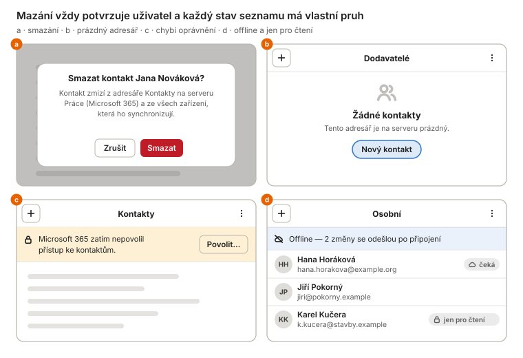

Pruhy jsou `Adw.Banner` jako v hlavním okně, na macOS karty se symbolem, na Windows `InfoBar`.

- **a** Na CardDAV je mazání nevratné, protože protokol koš nemá (Graph má vedle běžného smazání zvláštní `permanentDelete`, takže běžné smazání se dá vrátit). Proto potvrzení vždy, i s vypnutým „Potvrzovat mazání“, a v textu jméno účtu.
- **b** Prázdný adresář nabízí rovnou Nový kontakt.
- **c** Chyba `authRequired` s novým důvodem „chybí scope“. Povolit… spustí `account.oauthStart` pro tento účet s rozšířenými scopes; pošta mezitím běží dál.
- **d** Úpravy offline jdou do operačního logu (jako `message_ops`) a odešlou se po připojení. Štítek „čeká“ zmizí po potvrzení serverem.

### W11 macOS: okno Kontakty

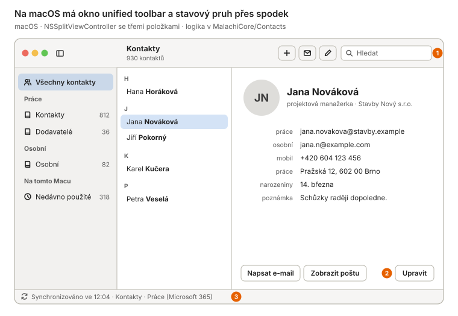

Karta připomíná Kontakty v macOS, logika je v `MalachiCore/Contacts`.

1. Hledací pole v toolbaru jako v hlavním okně; nové tlačítko, zápis a úprava jsou položky toolbaru. Zkratky ⌘N nový kontakt (v tomto okně), ⌘L úprava jako v Kontaktech.
2. Tlačítko Upravit je dole na kartě jako v Kontaktech macOS a zároveň v toolbaru. Kontakty macOS (`CNContactStore`) aplikace nečte ani nezapisuje, viz [varianty](#varianty-architektury). Obsah se s nimi přesto potká přes server, protože oba synchronizují tentýž adresář.
3. Stavový pruh přes spodek okna místo patičky sidebaru (odchylka z `macos/README.md`).

### W12 macOS: úprava

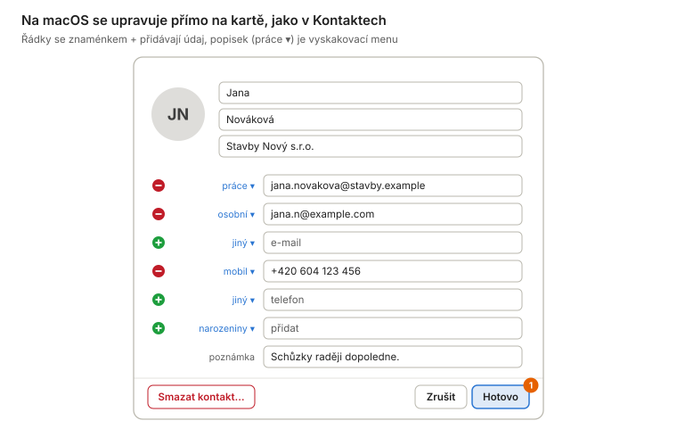

1. Hotovo = `contact.update`. Potvrzení mazání je `NSAlert` s pořadím tlačítek podle macOS (odchylka z tabulky); konflikt také `NSAlert` s tabulkou v accessory view.

### W13 Windows: okno Kontakty

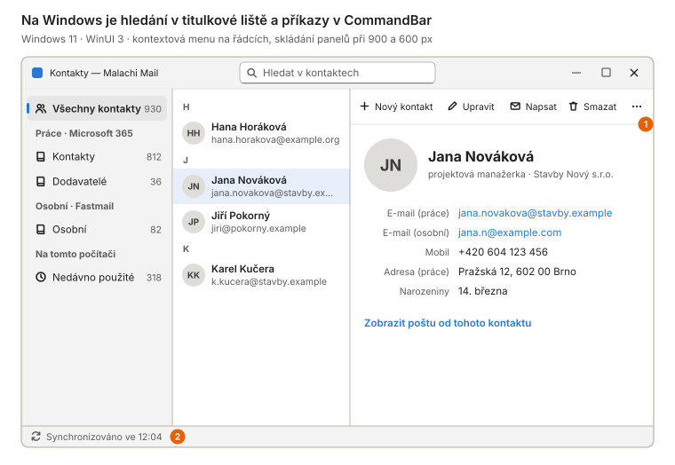

Hledání uprostřed titulkové lišty (Ctrl+E), `CommandBar` nad detailem, kontextová menu na řádcích.

1. Příkazy v `CommandBar` a totéž v kontextovém menu řádku (odchylka „kontextová menu“). Skládání panelů při 900/600 px s tlačítky v titulkové liště jako v hlavním okně.
2. Stavový pruh přes spodek okna (odchylka). Adresáře systému Windows (`Windows.ApplicationModel.Contacts`) se nepoužívají, viz [varianty](#varianty-architektury).

### W14 Windows: úprava a smazání

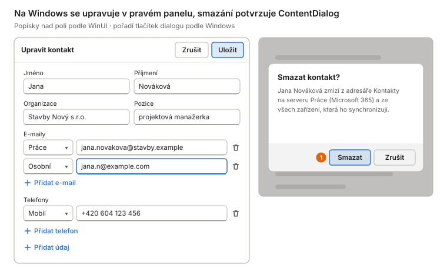

1. Pořadí tlačítek `ContentDialog` podle Windows (odchylka z tabulky), výchozí je Zrušit. Texty přes `L10n.T` s klíči = GTK msgid, nové msgid se tím do `parity-exclusions.txt` vůbec nedostanou.

## Etapy a náročnost

Každá etapa je sama o sobě užitečná a jde do všech tří klientů najednou. Čtení před zápisem: první etapa nemůže poškodit data na serveru, a přesto přinese hlavní užitek (serverové kontakty v doplňování na macOS a Windows).

| Etapa | Obsah |
| --- | --- |
| **0 · příprava** | Rozhodnutí vlastníka (níže) a nový záznam v `architecture.md` §7, který nahradí zamítnutí z 6. 9. Delegované oprávnění `Contacts.ReadWrite` ve vestavěné registraci Entra. `internal/vcard` s korpusem skutečných karet (Apple, Google, Nextcloud, Fastmail, Outlook export) a patologických případů, fuzz test round-tripu. |
| **1 · čtení** | Migrace, synchronizace CardDAV a Graph jen směrem dolů, `addressBook.*`, `contact.list/get/lookup`, zdroj `contacts` v `contact.search`, deduplikace s EDS. Discovery v průvodci a skupina Kontakty v úpravě účtu (W7, W8). Okno Kontakty jen pro čtení včetně Nedávno použitých a Zobrazit poštu, ve všech třech klientech (W1, W2, W4, W6, W10 b–c, W11, W13). MCP `search_contacts`, `get_contact`. |
| **2 · úpravy** | `contact.create/update/delete`, `contact_ops`, offline fronta, slučování a konflikt (W3, W9, W10 a, W10 d, W12, W14). Přidat do kontaktů z čipu a Uložit do kontaktů z Nedávno použitých (W5). MCP `create_contact`/`update_contact` za `--allow-modify`, politika příjemců pro `send_message`. |
| **3 · rozšíření** | Google (People API nebo CardDAV) přes token z GOA a přes vlastní klient uživatele. Fotky, skupiny a štítky, import a export vCard, přesun mezi adresáři. |

### Odhad rozsahu

Odhad vychází z velikosti dřívějších prací v tomto repozitáři (řádky včetně testů), ne z obecných měřítek:

| Dřívější práce | Řádky | Poznámka |
| --- | ---: | --- |
| Doplňování příjemců (`c09e62e`) | 1 100 | backend + GTK |
| Threading v backendu (`843db3e`) | 3 760 | jen backend |
| Hledání: backend, GTK, MCP (`7e35382`) | 3 910 | + macOS 1 190, Windows ≈ 3 000 + 2 000 testů |
| Přepis a hledání vlastními slovy | ≈ 9 200 | GTK 2 200, macOS 4 000, Windows 3 000 |

| Kontakty (odhad) | Etapa 1 | Etapa 2 | Etapa 3 | Z čeho |
| --- | ---: | ---: | ---: | --- |
| Backend (vCard, CardDAV, Graph, sync, store, API, docs) | 5 000–6 500 | 2 500–3 500 | 2 500–3 500 | 2 protokoly ≈ 2× threading; zápis a konflikty ≈ ½ |
| GTK + čistá logika v Go | 1 800–2 500 | 1 200–1 800 | 800–1 200 | nové okno ≈ hledání v GTK × 1,5 |
| macOS | 1 800–2 500 | 1 200–1 800 | 800–1 200 | poměr macOS/GTK z přepisu |
| Windows | 2 500–3 500 | 1 500–2 200 | 1 000–1 500 | více testů (Core, UI smoke) |
| **Celkem** | **11 000–15 000** | **6 400–9 300** | **5 100–7 400** | etapa 1 ≈ 1,5× hledání |

Převod na kalendář je nejistý. Hledání ve všech třech klientech (asi 8–10 tisíc řádků) trvalo zhruba 2–3 dny od backendu po Windows. Etapy 1 a 2 jsou dohromady 2–2,5× větší a mají víc neznámých: dva protokoly, skutečné servery a ověření na Macu a na Windows. Realisticky to jsou **2–3 týdny** soustředěné práce. Největší nejistota je v korpusu vCard (etapa 0): když se ukáže, že round-trip s některým serverem ztrácí data, etapa 2 se o to posune.

## Rizika a otevřené otázky

| Riziko | Dopad | Zmírnění |
| --- | --- | --- |
| Úprava kontaktu ztratí data, která zapsala jiná aplikace (skupiny `item1.EMAIL` z Apple, `X-` vlastnosti, vCard 3 vs. 4). | vysoký | Patch jen změněných vlastností, uchování surové karty, korpus skutečných karet a fuzz round-tripu; zápis až v etapě 2. |
| Chyba vede k hromadnému smazání na serveru. | vysoký | Mazání jen z výslovné operace v `contact_ops`, nikdy z rozdílu stavů; ztráta lokálních dat se nepropíše; potvrzení s počtem. |
| Nové oprávnění Microsoftu: uživatelé v organizacích s omezeným souhlasem potřebují správce. | střední | Inkrementální souhlas jen při zapnutí kontaktů; pošta běží beze změny; srozumitelný pruh „Povolit…“ (W10 c). |
| Duplicitní kontakty v doplňování (démon + EDS) na GNOME. | střední | Přeskočit knihy EDS účtu, jehož kontakty synchronizuje démon; slučování podle adresy už existuje. |
| Servery s neúplným CardDAV (bez `sync-collection`, bez ctag, nekonzistentní ETagy). | střední | Záložní cesta přes seznam ETagů; test proti Radicale, Baïkalu a Nextcloudu v CI podobně jako devmail. |
| Velké adresáře (desítky tisíc kontaktů) a výkon seznamu. | nízký | Stránkování v `contact.list`, v GTK `Gtk.ListView` se sekcemi (GTK 4.12+), na macOS `NSTableView`, na Windows virtualizovaný `ListView`. |
| Rozsah se rozroste (fotky, skupiny, GAL, sdílení). | nízký | Pevné etapy; vše mimo etapy 1–2 je samostatné rozhodnutí. |
| Licence závislostí. | žádný | `emersion/go-webdav` a `go-vcard` jsou MIT, stejný autor jako `go-imap`, `go-message` a `go-smtp`, které jádro už používá. |

## Rozhodnutí pro vlastníka

| Rozhodnutí | Doporučení | Proč |
| --- | --- | --- |
| Nahradit zamítnutí z 6. 9. (`architecture.md` §7) vlastní synchronizací v démonu (varianta C). | ano | Předpoklady tehdejšího rozhodnutí neplatí a jiná cesta k macOS a Windows nevede. |
| Přidat delegované `Contacts.ReadWrite` do registrace „Malachi Mail“ v Entra. | ano, s etapou 1 | Kdo kontakty nezapne, dostane stejný souhlas jako dnes (scope se žádá inkrementálně). |
| Samostatné okno Kontakty místo režimu v hlavním okně. | samostatné okno | Hlavní okno má čtyři body zlomu a panel asistenta; stejně to dělá Thunderbird i macOS. |
| Etapa 1 jen pro čtení. | ano | Nemůže poškodit data na serveru a přinese hlavní užitek (doplňování na macOS a Windows). |
| Google ve 3. etapě, nebo jen čtení přes GOA už v etapě 1. | 3. etapa | V GTK s GOA ho už pokrývá EDS; na macOS a Windows je Gmail s kontakty jen s vlastním klientem OAuth uživatele. |
| Konflikty: slučování po vlastnostech, dialog jen při kolizi stejného údaje, kolize z offline fronty jako kopie. | ano | Nic se tiše neztratí a dialog přijde jen tehdy, když opravdu nejde rozhodnout za uživatele. |
| Ukazovat Nedávno použité v okně Kontakty jako adresář jen pro čtení. | ano | Data už existují; okno má smysl i u účtu bez serverového adresáře. |
| Podmíněné zápisy CardDAV: vlastní požadavky, nebo příspěvek do `go-webdav`. | obojí | Vlastní požadavky hned (malý kód), příspěvek souběžně; až ho knihovna přijme, vlastní kód zmizí. |

### Co ověřit v etapě 0, než začne psaní UI

- Vrací Graph u `PATCH` kontaktu s `If-Match` odpověď 412? Dokumentace to neuvádí.
- Seznam s přihlášeným účtem: `sync-collection`, stabilita ETagů, verze vCard, kterou vrací a přijímá.
- Vlastnost `ContactsDisabled` účtu v GOA a chování tokenu, když má uživatel kontakty v GNOME vypnuté.
- Vlastní parser, nebo `go-vcard`: rozhodne korpus skutečných karet a fuzz round-tripu.

## Zdroje

Stav repozitáře: `main` k commitu `cc6bb26` (30. 9. 2026): `docs/architecture.md` §7, `docs/api.md` §2 a §4.11, `docs/security.md` §8–10, `docs/mcp.md`, `backend/internal/contacts`, `backend/internal/auth/oauth2flow/provider.go`, `backend/internal/auth/goa/goa.go`, `ui/data/ui/window.blp`, `ui/internal/window/addresses.go`, `ui/internal/compose/suggest.go`. Seznam ověřen dotazem na SRV a `OPTIONS` bez přihlášení 30. 9. 2026.

- GNOME Online Accounts: [goagoogleprovider.c (3.50.0)](https://gitlab.gnome.org/GNOME/gnome-online-accounts/-/raw/3.50.0/src/goabackend/goagoogleprovider.c), [goamsgraphprovider.c (3.52.0)](https://gitlab.gnome.org/GNOME/gnome-online-accounts/-/raw/3.52.0/src/goabackend/goamsgraphprovider.c), [NEWS](https://gitlab.gnome.org/GNOME/gnome-online-accounts/-/raw/master/NEWS)
- Evolution Data Server: [rozhraní AddressBook](https://gitlab.gnome.org/GNOME/evolution-data-server/-/raw/master/src/private/org.gnome.evolution.dataserver.AddressBook.xml), [Google přes CardDAV](https://gitlab.gnome.org/GNOME/evolution-data-server/-/commit/d63a1ce3921a6a6c573a6a70dbf2e152adf74c3f), [backend Microsoft 365](https://gitlab.gnome.org/GNOME/evolution-ews/-/raw/master/src/Microsoft365/addressbook/e-book-backend-m365.c)
- Google: [CardDAV API](https://developers.google.com/people/carddav), [people.connections.list](https://developers.google.com/people/api/rest/v1/people.connections/list), [migrace Contacts API](https://developers.google.com/people/contacts-api-migration), [omezené scopes](https://support.google.com/cloud/answer/13464325), [ověření citlivých scopes](https://developers.google.com/identity/protocols/oauth2/production-readiness/sensitive-scope-verification)
- Microsoft Graph: [contact](https://learn.microsoft.com/en-us/graph/api/resources/contact?view=graph-rest-1.0), [contact: delta](https://learn.microsoft.com/en-us/graph/api/contact-delta?view=graph-rest-1.0), [přehled oprávnění](https://learn.microsoft.com/en-us/graph/permissions-reference), [konec EWS](https://learn.microsoft.com/en-us/exchange/clients-and-mobile-in-exchange-online/deprecation-of-ews-exchange-online)
- Standardy: [RFC 6352](https://www.rfc-editor.org/rfc/rfc6352.html) (CardDAV), [RFC 6578](https://www.rfc-editor.org/rfc/rfc6578.html) (sync-collection), [RFC 6764](https://www.rfc-editor.org/rfc/rfc6764.html) (discovery), [RFC 6350](https://www.rfc-editor.org/rfc/rfc6350.html) (vCard 4)
- Poskytovatelé: [Seznam — poštovní programy](https://o-seznam.cz/napoveda/email/mohlo-by-se-hodit/postovni-programy-a-aplikace/), [Fastmail](https://www.fastmail.help/hc/en-us/articles/1500000278342-Server-names-and-ports), [Posteo](https://posteo.de/en/help/how-do-i-synchronise-my-posteo-address-book-with-other-programs-or-devices), [mailbox.org](https://kb.mailbox.org/en/private/security-and-privacy/application-passwords-for-external-programs/), [DAVx⁵: Google](https://www.davx5.com/tested-with/google)
- Knihovny: [go-webdav/carddav](https://pkg.go.dev/github.com/emersion/go-webdav/carddav), [go-vcard](https://pkg.go.dev/github.com/emersion/go-vcard)
- Platformy: [Contacts — autorizace](https://developer.apple.com/documentation/contacts/requesting-authorization-to-access-contacts), [ContactManager.RequestStoreAsync](https://learn.microsoft.com/en-us/uwp/api/windows.applicationmodel.contacts.contactmanager.requeststoreasync), [konec aplikace Lidé](https://support.microsoft.com/en-us/outlook/windows-mail-calendar-and-people-are-becoming-new-outlook)
- Jiní klienti: [Thunderbird 91](https://blog.thunderbird.net/2021/08/thunderbird-91-available-now/), [Thunderbird a Graph](https://blog.thunderbird.net/2026/09/thunderbird-desktop-new-protocol-support-microsoft-graph-api/), [Mailspring](https://www.getmailspring.com/docs/managing-address-book)
